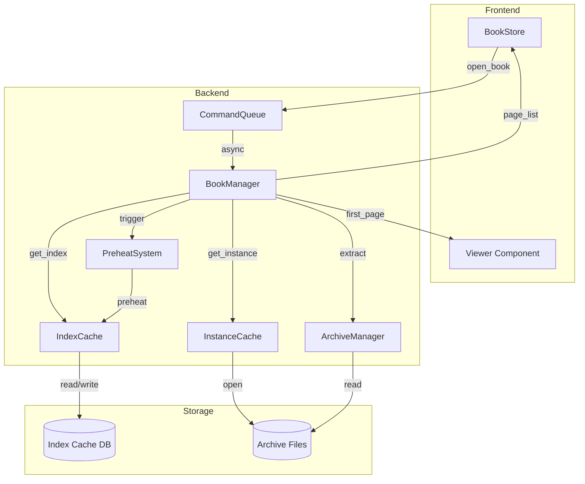

# Design Document: Archive Instant Loading

## Overview

本设计文档描述了压缩包秒开功能的技术实现方案。目标是将切换压缩包的加载时间从当前的数秒降低到 200ms 以内，实现类似 NeeView 的秒开体验。

核心策略：
1. **持久化索引缓存** - 避免重复扫描压缩包文件列表
2. **内存实例缓存** - 复用已打开的压缩包句柄
3. **首页优先加载** - 并行加载首页和文件列表
4. **邻近预热** - 预加载相邻压缩包索引
5. **异步命令队列** - 支持取消和优先级调度

## Architecture



## Components and Interfaces

### 1. IndexCache（索引缓存）

负责压缩包文件列表的持久化缓存。

```rust
pub struct IndexCache {
    memory_cache: LruCache<String, Arc<ArchiveIndex>>,
    cache_dir: PathBuf,
    max_size: u64,
    current_size: AtomicU64,
}

#[derive(Serialize, Deserialize)]
pub struct ArchiveIndex {
    pub version: u32,
    pub archive_path: String,
    pub archive_mtime: i64,
    pub archive_size: u64,
    pub entries: Vec<IndexEntry>,
    pub created_at: i64,
    pub last_accessed: i64,
}

#[derive(Serialize, Deserialize)]
pub struct IndexEntry {
    pub path: String,
    pub name: String,
    pub size: u64,
    pub entry_index: usize,
    pub is_image: bool,
    pub modified: Option<i64>,
}
```


### 2. InstanceCache（实例缓存）

缓存已打开的压缩包句柄，避免重复打开文件。

```rust
pub struct InstanceCache {
    cache: Mutex<HashMap<String, Weak<Mutex<ZipArchive<File>>>>>,
    max_entries: usize,
}

impl InstanceCache {
    pub fn get_or_create(&self, path: &Path) -> Result<Arc<Mutex<ZipArchive<File>>>, Error>;
    pub fn cleanup(&self);
    pub fn invalidate(&self, path: &Path);
}
```

### 3. PreheatSystem（预热系统）

后台预加载相邻压缩包的索引。

```rust
pub struct PreheatSystem {
    queue: Mutex<VecDeque<PathBuf>>,
    max_queue_size: usize,
    cancel_token: CancellationToken,
}

impl PreheatSystem {
    pub fn trigger(&self, current_archive: &Path);
    fn get_adjacent_archives(&self, path: &Path) -> (Option<PathBuf>, Option<PathBuf>);
    async fn preheat_task(&self, index_cache: Arc<IndexCache>);
}
```

### 4. CommandQueue（命令队列）

管理异步加载命令，支持取消和优先级。

```rust
pub struct LoadCommand {
    pub path: PathBuf,
    pub options: LoadOptions,
    pub cancel_token: CancellationToken,
}

pub struct CommandQueue {
    current: Mutex<Option<LoadCommand>>,
    completion_tx: broadcast::Sender<LoadResult>,
}

impl CommandQueue {
    pub async fn submit(&self, command: LoadCommand) -> Result<LoadResult, Error>;
    pub fn cancel_current(&self);
}
```

## Data Models

### 索引缓存文件格式

使用 bincode 序列化，文件结构：

```
+------------------+
| Magic (4 bytes)  |  "NIDX"
+------------------+
| Version (4 bytes)|
+------------------+
| Data Len (8 bytes)|
+------------------+
| Compressed Data  |
+------------------+
| CRC32 (4 bytes)  |
+------------------+
```

### 缓存目录结构

```
{app_data}/cache/archive_index/
├── index.db          # SQLite 索引数据库
├── {hash1}.idx       # 索引文件
├── {hash2}.idx
└── ...
```

## Correctness Properties

*A property is a characteristic or behavior that should hold true across all valid executions of a system-essentially, a formal statement about what the system should do. Properties serve as the bridge between human-readable specifications and machine-verifiable correctness guarantees.*

### Property 1: Index Cache Round-Trip
*For any* valid archive index, serializing and then deserializing the index SHALL produce an equivalent index with identical entries.
**Validates: Requirements 8.5**

### Property 2: Cache Validation Consistency
*For any* cached index and archive file, if the archive's modification time or size differs from the cached values, the cache SHALL be invalidated.
**Validates: Requirements 1.3, 1.4**

### Property 3: LRU Eviction Order
*For any* sequence of cache accesses, when the cache exceeds its size limit, the least recently accessed entries SHALL be evicted first.
**Validates: Requirements 1.6**

### Property 4: Instance Cache Reuse
*For any* archive path, opening the same archive twice within the cache lifetime SHALL return the same instance.
**Validates: Requirements 2.2**

### Property 5: First Page Availability
*For any* archive with at least one image, the first page SHALL be available before the complete page list is loaded.
**Validates: Requirements 3.2, 3.3**

### Property 6: Adjacent Archive Identification
*For any* archive in a folder with multiple archives, the preheat system SHALL correctly identify the next and previous archives in sorted order.
**Validates: Requirements 4.1**

### Property 7: Preheat Queue Limit
*For any* sequence of preheat requests, the queue size SHALL never exceed the configured maximum (5 archives).
**Validates: Requirements 4.5**

### Property 8: Command Cancellation
*For any* load command in progress, submitting a new command SHALL cancel the previous command before starting the new one.
**Validates: Requirements 6.2**

### Property 9: Performance Metrics Recording
*For any* archive loading operation, the performance monitor SHALL record non-negative timing values for all phases.
**Validates: Requirements 7.1, 7.2**

### Property 10: Version Compatibility
*For any* cached index with an incompatible version, loading SHALL trigger a rebuild instead of returning an error.
**Validates: Requirements 8.4**

## Error Handling

### 缓存错误

| 错误类型 | 处理策略 |
|---------|---------|
| 缓存文件损坏 | 删除损坏文件，重新扫描压缩包 |
| 磁盘空间不足 | 清理旧缓存，降级为内存缓存 |
| 权限错误 | 降级为内存缓存，记录警告日志 |

### 加载错误

| 错误类型 | 处理策略 |
|---------|---------|
| 压缩包损坏 | 显示错误消息，允许用户重试 |
| 首页加载失败 | 继续加载文件列表，显示占位图 |
| 取消操作 | 恢复之前状态，不显示错误 |

### 预热错误

| 错误类型 | 处理策略 |
|---------|---------|
| 预热失败 | 静默忽略，不影响用户操作 |
| 队列溢出 | 取消最旧的预热任务 |

## Testing Strategy

### 单元测试

- IndexCache 的 CRUD 操作
- InstanceCache 的缓存命中/未命中
- PreheatSystem 的队列管理
- CommandQueue 的取消逻辑

### 属性测试

使用 proptest 库进行属性测试：

1. **索引序列化往返测试** - 验证序列化/反序列化的一致性
2. **缓存验证测试** - 验证修改时间/大小变化时的缓存失效
3. **LRU 驱逐测试** - 验证驱逐顺序的正确性
4. **实例复用测试** - 验证相同路径返回相同实例
5. **首页优先测试** - 验证首页在完整列表之前可用
6. **相邻识别测试** - 验证相邻压缩包的正确识别
7. **队列限制测试** - 验证队列大小不超过限制
8. **命令取消测试** - 验证新命令取消旧命令
9. **性能记录测试** - 验证计时值非负
10. **版本兼容测试** - 验证不兼容版本触发重建

### 集成测试

- 完整的打开压缩包流程
- 切换压缩包的性能测试
- 预热系统的端到端测试

### 性能基准

- 首次打开压缩包：< 500ms
- 缓存命中打开：< 200ms
- 预热后打开：< 100ms
