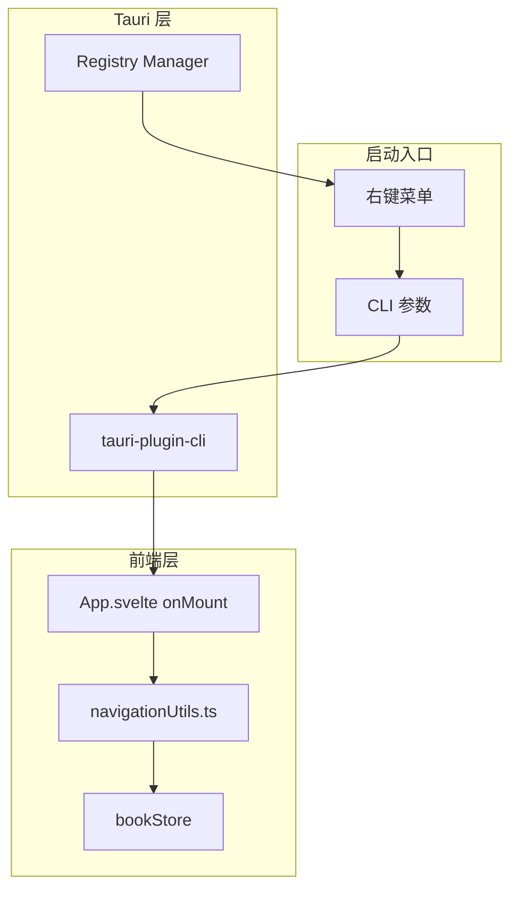

# Design Document: CLI Open Integration

## Overview

本设计文档描述了 NeoView 的 CLI 参数打开和右键菜单打开功能的实现方案。目标是复刻 NeeView 的行为，使用户可以通过命令行参数或 Windows 资源管理器右键菜单快速打开文件或文件夹。

当前问题：CLI 传参时会打开本地然后用默认应用打开传入的文件，而不是在应用内的 folder 卡片打开。

## Architecture

### 系统架构图



### 数据流

1. **CLI 启动流程**:
   - 用户通过命令行或右键菜单启动 NeoView，传入路径参数
   - Tauri CLI 插件解析参数
   - 前端 `App.svelte` 在 `onMount` 中获取参数
   - 调用 `openFileSystemItem` 处理路径
   - 根据路径类型（文件/文件夹/压缩包）调用相应的 bookStore 方法

2. **右键菜单注册流程**:
   - 用户在设置中启用/禁用右键菜单
   - 调用 Rust 后端的注册表操作函数
   - 在 `HKEY_CURRENT_USER\Software\Classes` 下创建/删除注册表项

## Components and Interfaces

### 1. CLI 参数处理 (前端)

**文件**: `src/App.svelte`

```typescript
// 现有实现需要增强
interface CLIStartupOptions {
  path: string;
  isDir: boolean;
  forceInApp: true;
}

async function handleCLIStartup(): Promise<void> {
  const matches = await getMatches();
  const cliPath = extractCLIPath(matches);
  
  if (cliPath) {
    const normalizedPath = await normalizePath(cliPath);
    const meta = await getFileMetadata(normalizedPath);
    await openFileSystemItem(normalizedPath, meta.isDir, { forceInApp: true });
  }
}
```

### 2. 路径处理工具 (前端)

**文件**: `src/lib/utils/pathUtils.ts` (新建)

```typescript
/**
 * 规范化路径，处理相对路径、特殊字符等
 */
export async function normalizePath(path: string): Promise<string>;

/**
 * 验证路径是否存在
 */
export async function validatePath(path: string): Promise<boolean>;

/**
 * 判断路径类型
 */
export async function getPathType(path: string): Promise<'file' | 'directory' | 'archive' | 'invalid'>;
```

### 3. 导航工具增强 (前端)

**文件**: `src/lib/utils/navigationUtils.ts`

现有的 `openFileSystemItem` 函数已经支持 `forceInApp` 选项，但需要确保：
- 所有文件类型都能正确处理
- 错误情况有适当的用户反馈

### 4. 右键菜单管理 (后端)

**文件**: `src-tauri/src/core/explorer_context_menu.rs`

现有实现已经完整，包括：
- `explorer_context_menu_exists()`: 检查注册表项是否存在
- `create_explorer_context_menu()`: 创建注册表项
- `delete_explorer_context_menu()`: 删除注册表项

## Data Models

### CLI 参数结构

```typescript
interface CLIMatches {
  args: {
    path?: {
      value: string | string[];
    };
  };
}
```

### 路径元数据

```typescript
interface PathMetadata {
  path: string;
  isDir: boolean;
  exists: boolean;
  isArchive?: boolean;
}
```

## Correctness Properties

*A property is a characteristic or behavior that should hold true across all valid executions of a system-essentially, a formal statement about what the system should do. Properties serve as the bridge between human-readable specifications and machine-verifiable correctness guarantees.*

### Property 1: CLI file path opens in viewer
*For any* valid file path passed as CLI argument, the file SHALL be opened in the viewer without invoking system default application.
**Validates: Requirements 1.1, 2.1**

### Property 2: CLI folder path opens as book
*For any* valid folder path passed as CLI argument, the folder SHALL be opened as a book in the viewer using `bookStore.openDirectoryAsBook`.
**Validates: Requirements 1.2, 2.2, 2.3**

### Property 3: CLI archive path opens as book
*For any* valid archive file path passed as CLI argument, the archive SHALL be opened as a book in the viewer using `bookStore.openBook`.
**Validates: Requirements 1.3**

### Property 4: Context menu registration round-trip
*For any* sequence of enable/disable operations on context menu, the `explorer_context_menu_exists()` function SHALL accurately reflect the current registration state.
**Validates: Requirements 3.3**

### Property 5: Path with spaces handled correctly
*For any* valid path containing space characters, the path SHALL be correctly parsed and opened without truncation or corruption.
**Validates: Requirements 4.1**

### Property 6: Path with special characters handled correctly
*For any* valid path containing special characters (中文、日文、特殊符号等), the path SHALL be correctly parsed and opened.
**Validates: Requirements 4.2**

### Property 7: Relative path resolution
*For any* relative path passed as CLI argument, the path SHALL be resolved to an absolute path before opening.
**Validates: Requirements 4.3**

## Error Handling

### 错误场景

1. **无效路径**: 显示错误提示，保持空状态
2. **权限不足**: 显示权限错误提示
3. **注册表操作失败**: 显示详细错误信息和解决建议
4. **网络路径不可达**: 显示网络错误提示

### 错误处理策略

```typescript
try {
  await openFileSystemItem(cliPath, meta.isDir, { forceInApp: true });
} catch (error) {
  if (error instanceof PathNotFoundError) {
    showErrorToast('路径不存在', cliPath);
  } else if (error instanceof PermissionError) {
    showErrorToast('权限不足', '无法访问该路径');
  } else {
    showErrorToast('打开失败', error.message);
  }
}
```

## Testing Strategy

### 单元测试

1. **路径规范化测试**
   - 测试相对路径转绝对路径
   - 测试特殊字符处理
   - 测试空格处理

2. **路径类型判断测试**
   - 测试文件/文件夹/压缩包识别

### 属性测试

使用 `fast-check` 库进行属性测试：

1. **Property 1-3**: 生成随机有效路径，验证正确的处理函数被调用
2. **Property 4**: 生成随机的启用/禁用序列，验证状态一致性
3. **Property 5-6**: 生成包含各种字符的路径，验证解析正确性
4. **Property 7**: 生成相对路径，验证转换为绝对路径

### 集成测试

1. **CLI 启动测试**: 使用不同类型的路径参数启动应用
2. **右键菜单测试**: 验证注册表操作的正确性

### 测试配置

- 属性测试最少运行 100 次迭代
- 每个属性测试需要标注对应的设计文档属性编号
