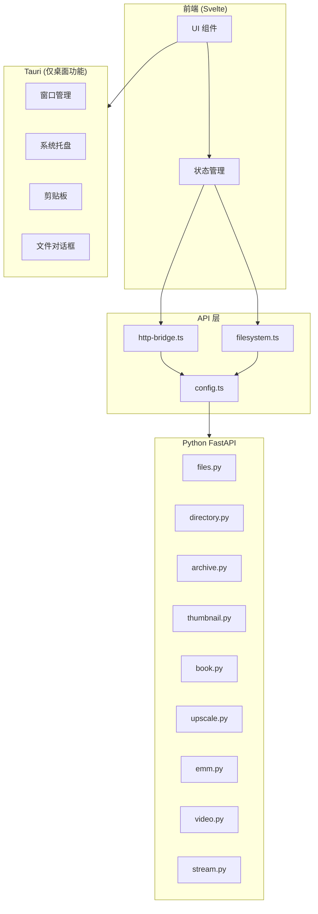

# Design Document: FastAPI 全面迁移

## Overview

本设计文档描述了将 NeoView 应用从 Tauri IPC + adapter 模式全面迁移到 FastAPI HTTP API 的技术方案。

### 当前架构

```
前端 (Svelte) 
    ↓ 
adapter.ts (invoke 函数)
    ↓
commandMap.ts (命令映射)
    ↓
HTTP 请求 → Python FastAPI
```

### 目标架构

```
前端 (Svelte)
    ↓
http-bridge.ts / filesystem.ts (直接 HTTP 调用)
    ↓
Python FastAPI
```

### 迁移范围

**需要删除的文件：**
- `src/lib/api/adapter.ts` - 适配层
- `src/lib/api/commandMap.ts` - 命令映射表

**需要保留的 Rust 功能：**
- 窗口管理 (minimize, maximize, close, fullscreen)
- 系统托盘 (tray.rs)
- 剪贴板操作 (tauri-plugin-clipboard-x)
- 文件对话框 (tauri-plugin-dialog)
- Shell 命令 (tauri-plugin-shell)

**需要删除的 Rust 命令模块：**
- `fs_commands.rs` - 文件系统命令 (已有 Python API)
- `book_commands.rs` - 书籍命令 (已有 Python API)
- `thumbnail_commands.rs` - 缩略图命令 (已有 Python API)
- `upscale_commands.rs` - 超分命令 (已有 Python API)
- `emm_metadata_commands.rs` - EMM 元数据命令 (已有 Python API)
- `video_commands.rs` - 视频命令 (已有 Python API)
- `stream_commands.rs` - 流式命令 (已有 Python API)
- `image_commands.rs` - 图片命令 (已有 Python API)
- `archive_commands.rs` - 压缩包命令 (已有 Python API)
- `benchmark_commands.rs` - 基准测试命令 (可删除)
- `page_commands.rs` - 页面命令 (已有 Python API)

## Architecture

### 组件关系图



### 迁移策略

1. **阶段一：前端代码迁移**
   - 将所有 `invoke` 调用替换为 `http-bridge.ts` 或 `filesystem.ts` 中的函数
   - 将 `convertFileSrc` 替换为 `getFileUrl`
   - 将 `convertArchiveFileSrc` 替换为 `getArchiveFileUrl`

2. **阶段二：删除适配层**
   - 删除 `adapter.ts`
   - 删除 `commandMap.ts`

3. **阶段三：精简 Rust 后端**
   - 删除与 Python 重复的命令模块
   - 保留 Tauri 桌面特有功能
   - 更新 `lib.rs` 移除未使用的命令注册

## Components and Interfaces

### http-bridge.ts 接口

```typescript
// 文件访问
function getFileUrl(path: string): string
function getArchiveFileUrl(archivePath: string, innerPath: string): string
function getThumbnailUrl(path: string, innerPath?: string, maxSize?: number): string

// API 调用
function apiGet<T>(endpoint: string, params?: Record<string, string | number | boolean>): Promise<T>
function apiPost<T>(endpoint: string, body?: unknown): Promise<T>
function apiDelete<T>(endpoint: string, params?: Record<string, string>): Promise<T>

// 目录操作
function listDirectory(path: string, filterSupported?: boolean): Promise<FileEntry[]>
function loadDirectorySnapshot(path: string, useCache?: boolean): Promise<DirectorySnapshot>

// 压缩包操作
function listArchive(path: string): Promise<ArchiveEntry[]>

// 书籍操作
function openBook(path: string): Promise<BookInfo>
function closeBook(): Promise<void>
function getCurrentBook(): Promise<BookInfo | null>
function navigateToPage(pageIndex: number): Promise<number>

// 健康检查
function checkHealth(): Promise<boolean>
function waitForBackend(maxWaitMs?: number, intervalMs?: number): Promise<boolean>
```

### filesystem.ts 接口

```typescript
// 目录浏览
function browseDirectory(path: string): Promise<FsItem[]>
function loadDirectorySnapshot(path: string): Promise<DirectorySnapshot>
function listSubfolders(path: string): Promise<SubfolderItem[]>

// 文件操作
function createDirectory(path: string): Promise<void>
function deletePath(path: string): Promise<void>
function renamePath(from: string, to: string): Promise<void>
function moveToTrash(path: string): Promise<void>
function pathExists(path: string): Promise<boolean>

// 压缩包操作
function listArchiveContents(archivePath: string): Promise<FsItem[]>
function loadImageFromArchive(archivePath: string, filePath: string): Promise<string>

// 流式加载
function streamDirectory(path: string, callbacks: StreamCallbacks, options?: StreamOptions): Promise<StreamHandle>
function streamSearch(path: string, query: string, callbacks: StreamCallbacks, options?: StreamOptions): Promise<StreamHandle>
```

### 保留的 Tauri 接口

```typescript
// 窗口管理 (通过 @tauri-apps/api/window)
interface AppWindow {
    minimize(): Promise<void>
    maximize(): Promise<void>
    close(): Promise<void>
    setFullscreen(fullscreen: boolean): Promise<void>
    isFullscreen(): Promise<boolean>
    startDragging(): Promise<void>
    setTitle(title: string): Promise<void>
    toggleMaximize(): Promise<void>
}

// 剪贴板 (通过 tauri-plugin-clipboard-x)
// 文件对话框 (通过 @tauri-apps/plugin-dialog)
// Shell 命令 (通过 @tauri-apps/plugin-shell)
```

## Data Models

### Python FastAPI 数据模型

```python
# 文件条目
class FileEntry(BaseModel):
    name: str
    path: str
    size: int
    modified: float
    created: Optional[float]
    is_dir: bool
    is_image: bool
    is_archive: bool
    is_video: bool
    is_epub: Optional[bool]

# 目录快照
class DirectorySnapshot(BaseModel):
    items: List[FileEntry]
    mtime: Optional[float]
    cached: bool

# 压缩包条目
class ArchiveEntry(BaseModel):
    name: str
    path: str
    size: int
    is_dir: bool
    is_image: bool
    entry_index: int
    modified: Optional[float]

# 书籍信息
class BookInfo(BaseModel):
    path: str
    name: str
    book_type: str
    pages: List[PageInfo]
    current_page: int
    total_pages: int

# 页面信息
class PageInfo(BaseModel):
    path: str
    name: str
    index: int
    width: Optional[int]
    height: Optional[int]
```

## Correctness Properties

*A property is a characteristic or behavior that should hold true across all valid executions of a system-essentially, a formal statement about what the system should do. Properties serve as the bridge between human-readable specifications and machine-verifiable correctness guarantees.*

### Property 1: API 功能等效性
*For any* API 调用，通过 http-bridge.ts 调用 Python FastAPI 应返回与原 adapter.ts + commandMap.ts 调用相同的结果
**Validates: Requirements 1.2, 2.1**

### Property 2: Python API 完整性
*For any* 被删除的 Rust 命令，Python FastAPI 应提供功能等效的 API 端点
**Validates: Requirements 3.2, 6.1, 6.2, 6.3, 6.4, 6.5, 6.6**

### Property 3: 编译验证
*For any* 代码修改，系统应通过 yarn check 和 cargo check 验证无错误
**Validates: Requirements 7.3, 7.4**

## Error Handling

### 前端错误处理

```typescript
// HTTP 请求错误处理
async function apiCall<T>(endpoint: string, options?: RequestInit): Promise<T> {
    const response = await fetch(url, options);
    
    if (!response.ok) {
        const text = await response.text();
        throw new Error(`API error ${response.status}: ${text}`);
    }
    
    return response.json();
}
```

### 后端健康检查

```typescript
// 等待后端启动
async function waitForBackend(maxWaitMs: number = 30000): Promise<boolean> {
    const startTime = Date.now();
    while (Date.now() - startTime < maxWaitMs) {
        if (await checkHealth()) return true;
        await new Promise(resolve => setTimeout(resolve, 500));
    }
    return false;
}
```

## Testing Strategy

### 单元测试

- 测试 http-bridge.ts 中的 URL 生成函数
- 测试 filesystem.ts 中的路径处理函数
- 测试 Python FastAPI 端点的响应格式

### 集成测试

- 测试前端到 Python 后端的完整调用链
- 测试 WebSocket 流式加载功能
- 测试文件系统操作的正确性

### 属性测试框架

使用 Vitest 进行前端测试，使用 pytest + hypothesis 进行 Python 后端属性测试。

```typescript
// 前端测试示例
import { describe, it, expect } from 'vitest';
import { getFileUrl, getArchiveFileUrl } from './http-bridge';

describe('http-bridge', () => {
    it('should generate correct file URL', () => {
        const url = getFileUrl('C:\\test\\image.jpg');
        expect(url).toContain('/file?path=');
        expect(url).toContain(encodeURIComponent('C:\\test\\image.jpg'));
    });
});
```

```python
# Python 属性测试示例
from hypothesis import given, strategies as st
import pytest

@given(st.text(min_size=1))
def test_file_path_encoding(path: str):
    """测试文件路径编码的往返一致性"""
    encoded = urllib.parse.quote(path)
    decoded = urllib.parse.unquote(encoded)
    assert decoded == path
```
