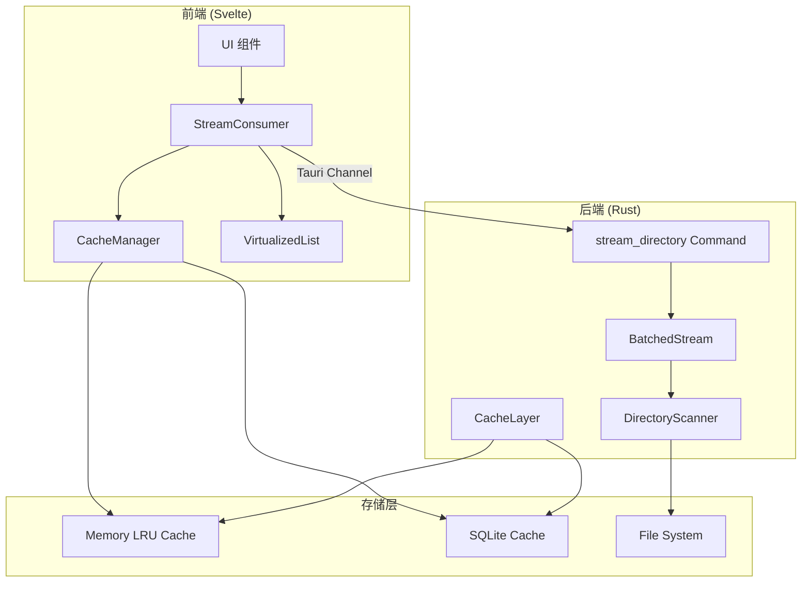

# Design Document: File Loading Performance Optimization

## Overview

本设计文档描述了 NeoView 文件加载性能优化的技术架构，参考 Spacedrive 项目的流式加载实现，在 Tauri 框架下实现真正的流式目录加载。

核心设计理念：
- **边扫描边返回**：使用 Tauri Channel 实现后端到前端的流式数据推送
- **批量化处理**：参考 Spacedrive 的 BatchedStream，每 15 项打包一次减少 IPC 开销
- **智能缓存**：多级缓存（内存 LRU + SQLite 持久化）+ 混合淘汰策略
- **取消支持**：使用 CancellationToken 支持流的优雅取消

## Architecture



## Components and Interfaces

### 1. Rust Backend Components

#### 1.1 DirectoryStreamOutput

流式输出的数据结构，参考 Spacedrive 的 `unsafe_streamed_query.rs`：

```rust
/// 流式输出枚举
#[derive(Debug, Clone, Serialize)]
#[serde(tag = "type", content = "data")]
pub enum DirectoryStreamOutput {
    /// 数据批次
    Batch(DirectoryBatch),
    /// 进度更新
    Progress(StreamProgress),
    /// 错误信息
    Error(StreamError),
    /// 完成信号
    Complete(StreamComplete),
}

#[derive(Debug, Clone, Serialize)]
#[serde(rename_all = "camelCase")]
pub struct DirectoryBatch {
    pub items: Vec<FsItem>,
    pub batch_index: usize,
}

#[derive(Debug, Clone, Serialize)]
#[serde(rename_all = "camelCase")]
pub struct StreamProgress {
    pub loaded: usize,
    pub estimated_total: Option<usize>,
    pub elapsed_ms: u64,
}

#[derive(Debug, Clone, Serialize)]
#[serde(rename_all = "camelCase")]
pub struct StreamError {
    pub message: String,
    pub path: Option<String>,
    pub skipped_count: usize,
}

#[derive(Debug, Clone, Serialize)]
#[serde(rename_all = "camelCase")]
pub struct StreamComplete {
    pub total_items: usize,
    pub skipped_items: usize,
    pub elapsed_ms: u64,
    pub from_cache: bool,
}
```

#### 1.2 DirectoryScanner

并行目录扫描器，使用 jwalk 实现：

```rust
pub struct DirectoryScanner {
    batch_size: usize,
    skip_hidden: bool,
}

impl DirectoryScanner {
    pub const DEFAULT_BATCH_SIZE: usize = 15;
    
    pub fn scan_streaming(
        &self,
        path: &Path,
        cancel_token: CancellationToken,
    ) -> impl Stream<Item = Result<Vec<FsItem>, ScanError>> {
        // 使用 async_stream 生成流
    }
}
```

#### 1.3 StreamManager

流管理器，处理流的生命周期和取消：

```rust
pub struct StreamManager {
    active_streams: DashMap<String, StreamHandle>,
}

pub struct StreamHandle {
    cancel_token: CancellationToken,
    path: PathBuf,
    started_at: Instant,
}

impl StreamManager {
    pub fn create_stream(&self, path: &Path) -> (String, CancellationToken);
    pub fn cancel_stream(&self, stream_id: &str);
    pub fn cancel_all_for_path(&self, path: &Path);
}
```

### 2. Frontend Components

#### 2.1 DirectoryStreamConsumer

前端流消费者，处理 Tauri Channel 事件：

```typescript
interface DirectoryStreamConsumer {
    // 开始流式加载
    startStream(path: string, options?: StreamOptions): Promise<StreamHandle>;
    
    // 取消流
    cancelStream(streamId: string): void;
    
    // 事件回调
    onBatch: (batch: FsItem[]) => void;
    onProgress: (progress: StreamProgress) => void;
    onComplete: (result: StreamComplete) => void;
    onError: (error: StreamError) => void;
}

interface StreamOptions {
    batchSize?: number;
    skipHidden?: boolean;
    sortBy?: SortField;
    sortOrder?: SortOrder;
}

interface StreamHandle {
    streamId: string;
    cancel: () => void;
    promise: Promise<StreamComplete>;
}
```

#### 2.2 DirectoryCache (Enhanced)

增强的目录缓存，支持流式写入：

```typescript
interface DirectoryCache {
    // 检查缓存
    get(path: string, mtime?: number): CacheEntry | null;
    
    // 流式写入（边接收边缓存）
    createStreamWriter(path: string, mtime?: number): StreamCacheWriter;
    
    // 完整写入
    set(path: string, items: FsItem[], mtime?: number): void;
    
    // 失效
    invalidate(path: string): void;
}

interface StreamCacheWriter {
    appendBatch(items: FsItem[]): void;
    complete(): void;
    abort(): void;
}
```

### 3. Tauri Command Interface

```rust
/// 流式浏览目录
#[tauri::command]
pub async fn stream_directory(
    path: String,
    options: Option<StreamOptions>,
    channel: Channel<DirectoryStreamOutput>,
    state: State<'_, StreamManagerState>,
) -> Result<String, String> {
    // 返回 stream_id
}

/// 取消流
#[tauri::command]
pub async fn cancel_directory_stream(
    stream_id: String,
    state: State<'_, StreamManagerState>,
) -> Result<(), String> {
    // 取消指定流
}

/// 取消路径的所有流
#[tauri::command]
pub async fn cancel_streams_for_path(
    path: String,
    state: State<'_, StreamManagerState>,
) -> Result<usize, String> {
    // 返回取消的流数量
}
```

## Data Models

### FsItem (Existing, Enhanced)

```rust
#[derive(Debug, Clone, Serialize, Deserialize)]
#[serde(rename_all = "camelCase")]
pub struct FsItem {
    pub path: String,
    pub name: String,
    pub is_directory: bool,
    pub is_archive: bool,
    pub size: u64,
    pub modified: Option<u64>,
    pub created: Option<u64>,
    // 新增字段
    pub has_children: Option<bool>,  // 目录是否有子项
    pub child_count: Option<usize>,  // 子项数量（可选）
}
```

### CacheEntry (Enhanced)

```rust
#[derive(Debug, Clone)]
pub struct CacheEntry {
    pub items: Vec<FsItem>,
    pub mtime: Option<u64>,
    pub timestamp: Instant,
    pub access_count: u32,
    pub is_complete: bool,  // 新增：是否完整加载
}
```


## Correctness Properties

*A property is a characteristic or behavior that should hold true across all valid executions of a system-essentially, a formal statement about what the system should do. Properties serve as the bridge between human-readable specifications and machine-verifiable correctness guarantees.*

Based on the prework analysis, the following correctness properties have been identified:

### Property 1: First Batch Latency

*For any* directory with more than 100 items, the time from stream request to first batch received SHALL be less than 100ms.

**Validates: Requirements 1.1**

### Property 2: Batch Size Constraints

*For any* batch emitted during directory streaming (except the final batch), the batch size SHALL be between 15 and 50 items inclusive.

**Validates: Requirements 1.2**

### Property 3: Stream Completion Signal

*For any* complete directory stream, after all data batches have been emitted, exactly one completion signal SHALL be emitted containing total items count and elapsed time.

**Validates: Requirements 1.4, 5.4, 6.3**

### Property 4: Stream Cancellation Behavior

*For any* active stream that is cancelled, the system SHALL: (a) stop emitting data events within 50ms, (b) release all associated resources, and (c) not emit any further events after cancellation.

**Validates: Requirements 1.5, 8.1, 8.2, 8.3**

### Property 5: Async Yielding

*For any* directory scan, the scanner SHALL yield to the event loop after processing each batch of 15 items, allowing other async tasks to execute.

**Validates: Requirements 2.2**

### Property 6: Cache Mtime Validation

*For any* cached directory, when the directory's mtime matches the cached mtime, the cache SHALL be used; when the mtime differs, the cache SHALL be invalidated and a fresh scan SHALL be performed.

**Validates: Requirements 3.1, 3.2, 3.3**

### Property 7: Cache Eviction Strategy

*For any* cache at capacity, when a new entry is added, the entry with the lowest combined score of recency and frequency SHALL be evicted.

**Validates: Requirements 3.4**

### Property 8: Streaming Search Results

*For any* search query on a directory, matching results SHALL be returned incrementally as they are found, with the first result appearing within 200ms of query submission.

**Validates: Requirements 4.1, 4.2**

### Property 9: Search Cancellation

*For any* active search, when the query is modified, the previous search SHALL be cancelled and a new search SHALL begin with the updated query.

**Validates: Requirements 4.4**

### Property 10: Schema Consistency

*For any* item emitted during streaming, the serialized JSON SHALL conform to the FsItem schema with all required fields present and correctly typed.

**Validates: Requirements 5.2**

### Property 11: Error Event Typing

*For any* error that occurs during streaming, the system SHALL emit a typed error event containing the error message and affected path.

**Validates: Requirements 5.3**

### Property 12: Progress Reporting

*For any* streaming operation in progress, progress events SHALL contain the count of items loaded so far.

**Validates: Requirements 6.2**

### Property 13: Permission Error Handling

*For any* directory scan that encounters permission errors on individual entries, the scan SHALL: (a) skip the inaccessible entry, (b) continue scanning remaining entries, (c) log the error with the affected path, and (d) report the skipped count in the completion event.

**Validates: Requirements 7.1, 7.2, 7.3**

### Property 14: Stream Deduplication

*For any* two concurrent stream requests for the same directory path, the system SHALL return the same stream handle and not create duplicate streams.

**Validates: Requirements 8.4**

## Error Handling

### Error Categories

1. **Immediate Errors** (返回 Result::Err)
   - 根目录不存在
   - 根目录无访问权限
   - 无效路径格式

2. **Streaming Errors** (通过 StreamError 事件)
   - 单个条目权限错误（跳过并继续）
   - 元数据读取失败（跳过并继续）
   - I/O 错误（记录并继续）

3. **Fatal Errors** (终止流并发送错误)
   - 磁盘空间不足
   - 系统资源耗尽

### Error Recovery

```rust
impl DirectoryScanner {
    fn handle_entry_error(&self, error: std::io::Error, path: &Path) -> ScanAction {
        match error.kind() {
            ErrorKind::PermissionDenied => {
                log::warn!("Permission denied: {}", path.display());
                ScanAction::Skip
            }
            ErrorKind::NotFound => {
                log::debug!("Entry not found (race condition): {}", path.display());
                ScanAction::Skip
            }
            _ => {
                log::error!("Unexpected error scanning {}: {}", path.display(), error);
                ScanAction::Skip
            }
        }
    }
}
```

## Testing Strategy

### Dual Testing Approach

本项目采用单元测试和属性测试相结合的方式：

- **单元测试**：验证具体示例和边界情况
- **属性测试**：验证跨所有输入的通用属性

### Property-Based Testing Framework

使用 **proptest** 作为 Rust 端的属性测试库，使用 **fast-check** 作为 TypeScript 端的属性测试库。

每个属性测试配置运行至少 100 次迭代。

### Test Categories

#### 1. Backend Unit Tests (Rust)

- DirectoryScanner 基本功能
- BatchedStream 批量化逻辑
- StreamManager 生命周期管理
- CacheLayer 缓存操作

#### 2. Backend Property Tests (Rust + proptest)

- 批次大小约束 (Property 2)
- 流完成信号 (Property 3)
- 取消行为 (Property 4)
- 缓存验证 (Property 6)
- 错误处理 (Property 13)

#### 3. Frontend Unit Tests (TypeScript + Vitest)

- DirectoryStreamConsumer 事件处理
- DirectoryCache 缓存逻辑
- StreamHandle 取消功能

#### 4. Frontend Property Tests (TypeScript + fast-check)

- Schema 一致性 (Property 10)
- 进度报告 (Property 12)
- 流去重 (Property 14)

#### 5. Integration Tests

- 端到端流式加载
- 缓存持久化和恢复
- 并发流处理

### Test Annotations

每个属性测试必须使用以下格式注释：

```rust
// **Feature: file-loading-performance, Property 2: Batch Size Constraints**
#[test]
fn test_batch_size_constraints() {
    // ...
}
```

```typescript
// **Feature: file-loading-performance, Property 10: Schema Consistency**
test('schema consistency', () => {
    // ...
});
```

