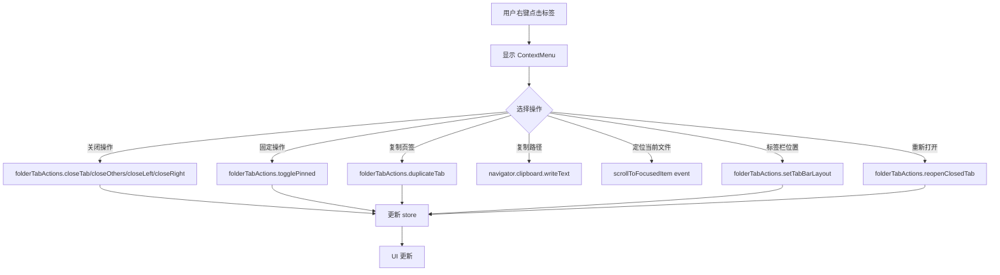

# Design Document: Folder Tab Context Menu

## Overview

本设计为文件面板标签栏（FolderTabBar）添加完整的右键菜单功能，提供类似浏览器标签页的操作体验。功能包括批量关闭、固定页签、复制页签、定位当前文件、侧边栏控制、复制路径和重新打开关闭的页签。

## Architecture

### 组件结构

```
FolderTabBar.svelte
├── ContextMenu (shadcn)
│   ├── 关闭操作组
│   │   ├── 关闭
│   │   ├── 关闭其他
│   │   ├── 关闭左侧
│   │   └── 关闭右侧
│   ├── 固定操作
│   │   └── 固定/取消固定
│   ├── 复制操作
│   │   ├── 复制页签
│   │   └── 复制路径
│   ├── 定位操作
│   │   └── 定位当前文件
│   ├── 标签栏位置控制组
│   │   └── 标签栏位置 (子菜单)
│   │       ├── 上
│   │       ├── 下
│   │       ├── 左
│   │       └── 右
│   └── 历史操作
│       └── 重新打开关闭的页签
└── Tab Items
```

### 数据流



## Components and Interfaces

### 1. FolderTabState 扩展

```typescript
interface FolderTabState {
  // ... 现有字段
  pinned: boolean;  // 新增：是否固定
}
```

### 2. 新增 Store 状态

```typescript
// 最近关闭的标签页列表
interface RecentlyClosedTab {
  path: string;
  title: string;
  closedAt: number;
}

// 在 folderTabStore 中新增
const recentlyClosedTabs = writable<RecentlyClosedTab[]>([]);
const MAX_RECENTLY_CLOSED = 10;
```

### 3. 新增 Actions

```typescript
interface FolderTabActions {
  // 关闭操作
  closeOthers(tabId: string): void;
  closeLeft(tabId: string): void;
  closeRight(tabId: string): void;
  
  // 固定操作
  togglePinned(tabId: string): void;
  setPinned(tabId: string, pinned: boolean): void;
  
  // 重新打开
  reopenClosedTab(): string | null;
  getRecentlyClosedTabs(): RecentlyClosedTab[];
  
  // 标签栏位置控制
  setTabBarLayout(layout: 'top' | 'left' | 'right' | 'bottom'): void;
}
```

### 4. 事件接口

```typescript
// 定位当前文件事件
interface ScrollToFocusedItemEvent {
  tabId: string;
}
```

## Data Models

### RecentlyClosedTab

| 字段 | 类型 | 描述 |
|------|------|------|
| path | string | 标签页路径 |
| title | string | 标签页标题 |
| closedAt | number | 关闭时间戳 |

### FolderTabState 扩展

| 字段 | 类型 | 默认值 | 描述 |
|------|------|--------|------|
| pinned | boolean | false | 是否固定 |

### 共享设置扩展

| 字段 | 类型 | 默认值 | 描述 |
|------|------|--------|------|
| tabBarLayout | 'top' \| 'left' \| 'right' \| 'bottom' | 'top' | 标签栏位置 |

## Correctness Properties

*A property is a characteristic or behavior that should hold true across all valid executions of a system-essentially, a formal statement about what the system should do. Properties serve as the bridge between human-readable specifications and machine-verifiable correctness guarantees.*

### Property 1: Close tab removes exactly one tab
*For any* tab list with more than one non-pinned tab, closing a specific tab should result in the list length decreasing by exactly one, and the closed tab should no longer exist in the list.
**Validates: Requirements 1.1**

### Property 2: Close others preserves target and pinned tabs
*For any* tab list, executing "close others" on a target tab should result in a list containing only the target tab and all previously pinned tabs.
**Validates: Requirements 1.2, 2.4**

### Property 3: Close left preserves target, right tabs, and pinned tabs
*For any* tab list, executing "close left" on a target tab should result in a list where all tabs to the left of the target are either pinned or removed, and all tabs at or to the right of the target remain.
**Validates: Requirements 1.3, 2.4**

### Property 4: Close right preserves target, left tabs, and pinned tabs
*For any* tab list, executing "close right" on a target tab should result in a list where all tabs to the right of the target are either pinned or removed, and all tabs at or to the left of the target remain.
**Validates: Requirements 1.4, 2.4**

### Property 5: Pin/unpin round trip
*For any* tab, pinning and then unpinning (or vice versa) should return the tab to its original pinned state.
**Validates: Requirements 2.1, 2.2**

### Property 6: Pinned state persistence round trip
*For any* tab with a pinned state, serializing and deserializing the tab state should preserve the pinned value.
**Validates: Requirements 2.5**

### Property 7: Duplicate tab creates identical copy
*For any* tab, duplicating it should create a new tab with the same path, and the new tab should be inserted immediately after the original tab, and the new tab should become active.
**Validates: Requirements 3.1, 3.2, 3.3**

### Property 8: Recently closed list bounded size
*For any* sequence of tab close operations, the recently closed list should never exceed 10 entries.
**Validates: Requirements 6.1**

### Property 9: Reopen restores most recent
*For any* non-empty recently closed list, reopening should restore the most recently closed tab's path and remove it from the list.
**Validates: Requirements 6.2**

### Property 10: Tab bar layout update
*For any* layout value (top, bottom, left, right), setting the tab bar layout should update the tabBarLayout to that value.
**Validates: Requirements 7.2**

## Error Handling

| 场景 | 处理方式 |
|------|----------|
| 关闭最后一个非固定标签页 | 禁用关闭选项，保留至少一个标签页 |
| 复制路径到剪贴板失败 | 显示错误 toast 通知 |
| 重新打开时列表为空 | 禁用"重新打开"选项 |
| 定位当前文件时无焦点项 | 禁用"定位当前文件"选项 |
| 虚拟路径标签页 | 部分操作（如复制路径）正常工作，侧边栏定位禁用 |

## Testing Strategy

### 单元测试

使用 Vitest 进行单元测试：

1. **Store Actions 测试**
   - 测试 closeOthers、closeLeft、closeRight 的正确性
   - 测试 togglePinned、setPinned 的状态变化
   - 测试 reopenClosedTab 的恢复逻辑
   - 测试 recentlyClosedTabs 的边界条件

2. **序列化测试**
   - 测试 pinned 状态的持久化和恢复

### 属性测试

使用 fast-check 进行属性测试：

1. **批量关闭属性测试**
   - 生成随机标签页列表（包含固定和非固定）
   - 验证关闭操作后的列表状态符合预期

2. **固定状态属性测试**
   - 验证 pin/unpin 的 round-trip 特性
   - 验证序列化/反序列化的 round-trip 特性

3. **最近关闭列表属性测试**
   - 验证列表大小边界
   - 验证 FIFO 顺序

### 测试框架配置

```typescript
// vitest.config.ts
export default defineConfig({
  test: {
    // 属性测试配置
    testTimeout: 30000, // 属性测试可能需要更长时间
  }
});
```

每个属性测试应运行至少 100 次迭代以确保覆盖边界情况。
