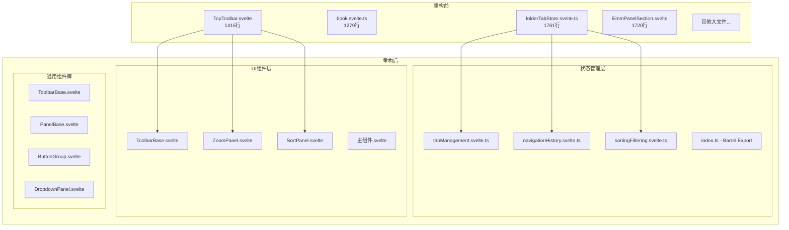

# 设计文档

## 概述

本设计文档描述了前端代码重构的技术方案，目标是将15个超过800行的大文件拆分为更小、更可维护的模块。重构遵循模块化组合原则，使用 Barrel Export 模式统一导出，确保 API 兼容性。

## 架构

### 整体架构



### 目录结构

```
src/lib/
├── components/
│   ├── common/                          # 新增：通用组件库
│   │   ├── ToolbarBase.svelte
│   │   ├── PanelBase.svelte
│   │   ├── ButtonGroup.svelte
│   │   ├── DropdownPanel.svelte
│   │   └── index.ts
│   ├── layout/
│   │   ├── TopToolbar/                  # 重构：拆分为目录
│   │   │   ├── TopToolbar.svelte
│   │   │   ├── ZoomPanel.svelte
│   │   │   ├── RotatePanel.svelte
│   │   │   ├── SortPanel.svelte
│   │   │   └── index.ts
│   │   └── BottomThumbnailBar/
│   │       ├── BottomThumbnailBar.svelte
│   │       ├── ThumbnailItem.svelte
│   │       └── index.ts
│   ├── panels/
│   │   ├── folderPanel/
│   │   │   ├── components/
│   │   │   │   ├── FolderToolbar/       # 重构：拆分为目录
│   │   │   │   │   ├── FolderToolbar.svelte
│   │   │   │   │   ├── NavigationButtons.svelte
│   │   │   │   │   ├── ViewModeButtons.svelte
│   │   │   │   │   └── index.ts
│   │   │   │   └── FolderStack/
│   │   │   │       ├── FolderStack.svelte
│   │   │   │       ├── StackItem.svelte
│   │   │   │       └── index.ts
│   │   │   └── stores/
│   │   │       ├── folderTabStore/      # 重构：拆分为目录
│   │   │       │   ├── tabManagement.svelte.ts
│   │   │       │   ├── navigationHistory.svelte.ts
│   │   │       │   ├── sortingFiltering.svelte.ts
│   │   │       │   ├── virtualPaths.svelte.ts
│   │   │       │   ├── core.svelte.ts
│   │   │       │   └── index.ts
│   │   │       └── folderPanelStore/
│   │   │           ├── panelState.svelte.ts
│   │   │           ├── selectionState.svelte.ts
│   │   │           ├── core.svelte.ts
│   │   │           └── index.ts
│   │   └── emm/
│   │       ├── EmmPanelSection/         # 重构：拆分为目录
│   │       │   ├── EmmPanelSection.svelte
│   │       │   ├── TagsPanel.svelte
│   │       │   ├── FavoriteTagsPanel.svelte
│   │       │   ├── RatingsPanel.svelte
│   │       │   └── index.ts
│   └── viewer/
│       └── VideoPlayer/                 # 重构：拆分为目录
│           ├── VideoPlayer.svelte
│           ├── VideoControls.svelte
│           ├── VideoProgressBar.svelte
│           └── index.ts
├── stores/
│   ├── book/                            # 重构：拆分为目录
│   │   ├── pageNavigation.svelte.ts
│   │   ├── zoomRotation.svelte.ts
│   │   ├── upscaleManagement.svelte.ts
│   │   ├── core.svelte.ts
│   │   └── index.ts
│   ├── keybindings/                     # 重构：拆分为目录
│   │   ├── keyMappings.svelte.ts
│   │   ├── keyHandlers.svelte.ts
│   │   ├── keyCategories.svelte.ts
│   │   ├── core.svelte.ts
│   │   └── index.ts
│   └── settingsManager/                 # 重构：拆分为目录
│       ├── settingsExportImport.ts
│       ├── settingsValidator.ts
│       ├── core.svelte.ts
│       └── index.ts
├── api/
│   └── filesystem/                      # 重构：拆分为目录
│       ├── fileOperations.ts
│       ├── archiveOperations.ts
│       ├── streamOperations.ts
│       ├── core.ts
│       └── index.ts
└── cards/
    └── ai/
        └── AiServiceConfigCard/         # 重构：拆分为目录
            ├── AiServiceConfigCard.svelte
            ├── LibreTranslateConfig.svelte
            ├── OllamaConfig.svelte
            └── index.ts
```

## 组件和接口

### 通用组件库接口

```typescript
// src/lib/components/common/ToolbarBase.svelte
// 工具栏基础组件，提供统一的工具栏布局和样式
interface ToolbarBaseProps {
  position: 'top' | 'bottom' | 'left' | 'right';
  autoHide?: boolean;
  autoHideDelay?: number;
  class?: string;
}

// src/lib/components/common/PanelBase.svelte
// 面板基础组件，提供统一的面板布局和折叠功能
interface PanelBaseProps {
  title: string;
  collapsible?: boolean;
  defaultCollapsed?: boolean;
  class?: string;
}

// src/lib/components/common/ButtonGroup.svelte
// 按钮组组件，提供统一的按钮组布局
interface ButtonGroupProps {
  orientation: 'horizontal' | 'vertical';
  gap?: number;
  class?: string;
}

// src/lib/components/common/DropdownPanel.svelte
// 下拉面板组件，提供统一的下拉面板功能
interface DropdownPanelProps {
  trigger: 'click' | 'hover';
  position: 'top' | 'bottom' | 'left' | 'right';
  closeOnClickOutside?: boolean;
  class?: string;
}
```

### Barrel Export 模式

```typescript
// 示例：src/lib/stores/book/index.ts
// 统一导出所有 book 相关的状态和函数
export * from './pageNavigation.svelte';
export * from './zoomRotation.svelte';
export * from './upscaleManagement.svelte';
export * from './core.svelte';

// 保持向后兼容的默认导出
export { bookStore as default } from './core.svelte';
```

## 数据模型

### 模块拆分规则

```typescript
// 模块拆分配置
interface ModuleSplitConfig {
  // 原文件路径
  sourcePath: string;
  // 目标目录
  targetDir: string;
  // 拆分后的模块列表
  modules: ModuleConfig[];
  // 最大行数限制
  maxLines: number;
}

interface ModuleConfig {
  // 模块名称
  name: string;
  // 模块文件名
  fileName: string;
  // 模块职责描述
  description: string;
  // 预期行数范围
  expectedLines: { min: number; max: number };
}
```

### 重构配置

```typescript
// 状态管理层重构配置
const storeRefactorConfigs: ModuleSplitConfig[] = [
  {
    sourcePath: 'src/lib/components/panels/folderPanel/stores/folderTabStore.svelte.ts',
    targetDir: 'src/lib/components/panels/folderPanel/stores/folderTabStore',
    maxLines: 400,
    modules: [
      { name: 'tabManagement', fileName: 'tabManagement.svelte.ts', description: '标签页管理', expectedLines: { min: 200, max: 400 } },
      { name: 'navigationHistory', fileName: 'navigationHistory.svelte.ts', description: '导航历史', expectedLines: { min: 150, max: 300 } },
      { name: 'sortingFiltering', fileName: 'sortingFiltering.svelte.ts', description: '排序过滤', expectedLines: { min: 200, max: 400 } },
      { name: 'virtualPaths', fileName: 'virtualPaths.svelte.ts', description: '虚拟路径', expectedLines: { min: 150, max: 300 } },
      { name: 'core', fileName: 'core.svelte.ts', description: '核心状态', expectedLines: { min: 200, max: 400 } },
    ]
  },
  // ... 其他配置
];
```

## 正确性属性

*正确性属性是一种应该在系统所有有效执行中保持为真的特征或行为——本质上是关于系统应该做什么的形式化陈述。属性作为人类可读规范和机器可验证正确性保证之间的桥梁。*

### Property 1: 文件行数限制

*对于任意* 重构后的文件，其行数应该不超过800行（严格限制），且目标不超过400行（推荐限制）。

**验证: 需求 1.1-1.5, 2.1-2.9, 3.1, 5.1**

### Property 2: API 兼容性

*对于任意* 被重构的模块，重构后通过 Barrel Export 导出的公共 API 应该包含重构前的所有公共导出。

**验证: 需求 1.6, 3.3**

### Property 3: 模块数量限制

*对于任意* 被拆分的大文件，拆分后的模块数量应该不超过配置中指定的最大模块数。

**验证: 需求 1.1-1.5, 2.1-2.9, 3.1**

## 错误处理

### 重构过程中的错误处理

1. **导入路径错误**: 重构后需要更新所有引用该模块的导入路径
2. **循环依赖**: 拆分模块时需要避免引入循环依赖
3. **类型错误**: 确保拆分后的模块类型定义完整
4. **运行时错误**: 通过 `yarn check` 和测试验证功能完整性

### 回滚策略

1. 使用 Git 分支进行重构
2. 每个大文件的重构作为独立的 commit
3. 如果重构失败，可以回滚到上一个稳定状态

## 测试策略

### 单元测试

- 验证拆分后的模块功能正确
- 验证 Barrel Export 导出完整
- 验证通用组件的基本功能

### 属性测试

使用 Vitest 进行属性测试，验证以下属性：

1. **文件行数属性测试**: 验证所有重构后的文件行数不超过限制
2. **API 兼容性属性测试**: 验证重构前后的导出一致性

### 集成测试

- 运行 `yarn check` 验证 TypeScript 类型
- 运行 `yarn lint` 验证代码风格
- 运行 `yarn build` 验证构建成功

### 测试配置

```typescript
// vitest.config.ts 中的属性测试配置
export default defineConfig({
  test: {
    // 属性测试最少运行100次
    fuzz: {
      iterations: 100
    }
  }
});
```
