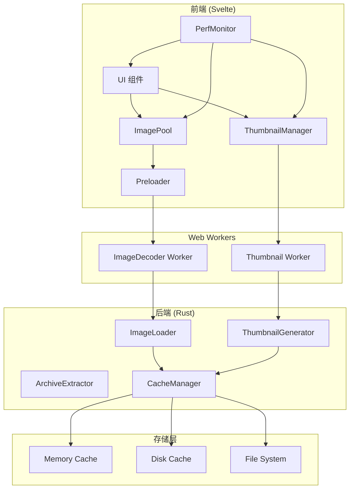

# Design Document: Full Pipeline Performance Optimization

## Overview

本设计文档描述了 NeoView 全流程性能优化的技术架构。在现有流式目录加载的基础上，进一步优化图像加载、渲染和 UI 响应性能。

核心设计理念：
- **智能预加载**：基于用户行为预测，提前加载即将显示的内容
- **后台处理**：将耗时操作移至后台线程，保持 UI 响应
- **分层缓存**：内存缓存 + 磁盘缓存 + 预加载队列
- **自适应策略**：根据系统资源动态调整性能参数

## Architecture



## Components and Interfaces

### 1. ImagePool (图像池)

管理图像的加载、缓存和生命周期。

```typescript
interface ImagePoolConfig {
  maxMemoryMB: number;        // 最大内存使用 (默认 512MB)
  preloadAhead: number;       // 预加载前方页数 (默认 3)
  preloadBehind: number;      // 预加载后方页数 (默认 1)
  lowPriorityDelay: number;   // 低优先级延迟 (默认 100ms)
}

interface ImageEntry {
  url: string;                // Object URL 或 data URL
  blob: Blob;                 // 原始 Blob 数据
  width: number;
  height: number;
  size: number;               // 字节大小
  loadTime: number;           // 加载耗时 (ms)
  lastAccess: number;         // 最后访问时间
  priority: 'high' | 'normal' | 'low';
}

interface ImagePool {
  // 获取图像（优先从缓存）
  get(key: string): Promise<ImageEntry | null>;
  
  // 预加载图像
  preload(keys: string[], priority: 'high' | 'normal' | 'low'): void;
  
  // 取消预加载
  cancelPreload(keys: string[]): void;
  
  // 清理缓存
  evict(keys?: string[]): void;
  
  // 获取缓存状态
  getStats(): CacheStats;
}
```

### 2. Preloader (预加载器)

智能预加载策略实现。

```typescript
interface PreloadStrategy {
  // 计算需要预加载的页面
  calculatePreloadPages(
    currentPage: number,
    totalPages: number,
    direction: 'forward' | 'backward' | 'unknown'
  ): number[];
  
  // 更新预加载队列
  updateQueue(pages: number[]): void;
  
  // 取消跳过的页面
  cancelSkipped(fromPage: number, toPage: number): void;
}

interface PreloaderConfig {
  maxConcurrent: number;      // 最大并发数 (默认 2)
  batchSize: number;          // 批次大小 (默认 3)
  idleDelay: number;          // 空闲延迟 (默认 200ms)
}
```

### 3. ThumbnailManager (缩略图管理器)

管理缩略图的批量加载和优先级。

```typescript
interface ThumbnailRequest {
  path: string;
  priority: number;           // 优先级分数 (越高越优先)
  visible: boolean;           // 是否可见
  callback: (url: string | null) => void;
}

interface ThumbnailManager {
  // 请求缩略图
  request(path: string, priority: number): Promise<string | null>;
  
  // 批量请求
  requestBatch(paths: string[]): Promise<Map<string, string | null>>;
  
  // 更新可见性
  updateVisibility(visiblePaths: Set<string>): void;
  
  // 取消请求
  cancel(paths: string[]): void;
}
```

### 4. PerfMonitor (性能监控器)

跟踪和报告性能指标。

```typescript
interface PerfMetrics {
  imageLoadTime: number[];    // 图像加载时间样本
  ipcLatency: number[];       // IPC 延迟样本
  frameRate: number[];        // 帧率样本
  memoryUsage: number[];      // 内存使用样本
}

interface PerfThresholds {
  maxImageLoadTime: number;   // 最大图像加载时间 (默认 1000ms)
  maxIpcLatency: number;      // 最大 IPC 延迟 (默认 100ms)
  minFrameRate: number;       // 最小帧率 (默认 30fps)
  maxMemoryUsage: number;     // 最大内存使用 (默认 1GB)
}

interface PerfMonitor {
  // 记录指标
  record(metric: keyof PerfMetrics, value: number): void;
  
  // 获取统计
  getStats(): PerfStats;
  
  // 检查阈值
  checkThresholds(): PerfWarning[];
  
  // 获取优化建议
  getSuggestions(): string[];
}
```

### 5. Backend Components

#### 5.1 ImageLoader (Rust)

```rust
/// 图像加载配置
pub struct ImageLoaderConfig {
    /// 最大并发解码数
    pub max_concurrent_decode: usize,
    /// 大图像阈值 (字节)
    pub large_image_threshold: usize,
    /// 是否启用渐进式解码
    pub progressive_decode: bool,
}

/// 图像加载结果
pub struct ImageLoadResult {
    pub data: Vec<u8>,
    pub width: u32,
    pub height: u32,
    pub format: String,
    pub load_time_ms: u64,
}

impl ImageLoader {
    /// 加载图像（自动选择最优策略）
    pub async fn load(&self, path: &Path) -> Result<ImageLoadResult, LoadError>;
    
    /// 批量加载
    pub async fn load_batch(&self, paths: &[PathBuf]) -> Vec<Result<ImageLoadResult, LoadError>>;
    
    /// 流式加载大图像
    pub fn load_streaming(&self, path: &Path, channel: Channel<ImageChunk>) -> Result<(), LoadError>;
}
```

#### 5.2 ArchiveExtractor (Rust)

```rust
/// 压缩包提取器
pub struct ArchiveExtractor {
    /// 并行度
    pub parallelism: usize,
    /// 缓存目录
    pub cache_dir: PathBuf,
}

impl ArchiveExtractor {
    /// 流式列出内容
    pub fn list_streaming(&self, path: &Path, channel: Channel<ArchiveEntry>) -> Result<(), ExtractError>;
    
    /// 并行提取多个文件
    pub async fn extract_batch(&self, archive: &Path, entries: &[String]) -> Vec<Result<Vec<u8>, ExtractError>>;
    
    /// 提取单个文件（带缓存）
    pub async fn extract_cached(&self, archive: &Path, entry: &str) -> Result<Vec<u8>, ExtractError>;
}
```

## Data Models

### CacheStats

```typescript
interface CacheStats {
  totalEntries: number;
  totalSizeBytes: number;
  hitCount: number;
  missCount: number;
  hitRate: number;
  evictionCount: number;
  oldestEntry: number;        // 最老条目的时间戳
  newestEntry: number;        // 最新条目的时间戳
}
```

### PerfStats

```typescript
interface PerfStats {
  avgImageLoadTime: number;
  p95ImageLoadTime: number;
  avgIpcLatency: number;
  p95IpcLatency: number;
  avgFrameRate: number;
  minFrameRate: number;
  currentMemoryUsage: number;
  peakMemoryUsage: number;
}
```

### SystemCapabilities

```typescript
interface SystemCapabilities {
  totalMemoryMB: number;
  availableMemoryMB: number;
  cpuCores: number;
  isLowEndDevice: boolean;
  recommendedPreloadCount: number;
  recommendedCacheSizeMB: number;
}
```

## Correctness Properties

*A property is a characteristic or behavior that should hold true across all valid executions of a system-essentially, a formal statement about what the system should do. Properties serve as the bridge between human-readable specifications and machine-verifiable correctness guarantees.*

Based on the prework analysis, the following correctness properties have been identified:

### Property 1: Preloaded Image Display Latency

*For any* preloaded image, when the user navigates to that page, the image SHALL be displayed within 50ms.

**Validates: Requirements 1.1**

### Property 2: Preload Queue Correctness

*For any* page position in a book, the preload queue SHALL contain exactly the next N pages (configurable, default 3) and previous M pages (configurable, default 1), where N and M are bounded by book boundaries.

**Validates: Requirements 1.2**

### Property 3: Preload Priority

*For any* preload request, the request priority SHALL be lower than the current page's load request, ensuring current page rendering is not blocked.

**Validates: Requirements 1.3**

### Property 4: Cache Eviction on Memory Limit

*For any* cache state where memory usage exceeds the configured limit, the system SHALL evict entries in LRU order until memory usage is below the limit.

**Validates: Requirements 1.4**

### Property 5: Preload Cancellation on Rapid Navigation

*For any* rapid page navigation (skipping pages), pending preload requests for skipped pages SHALL be cancelled before new preloads are queued.

**Validates: Requirements 1.5**

### Property 6: Large Image Background Decoding

*For any* image larger than 5MB, the decoding operation SHALL be performed in a background thread (Web Worker or spawn_blocking).

**Validates: Requirements 2.1**

### Property 7: Decode Error Handling

*For any* image that fails to decode, the system SHALL display an error placeholder and log the error with the image path.

**Validates: Requirements 2.5**

### Property 8: Thumbnail Batch Size

*For any* thumbnail loading operation, the batch size SHALL not exceed 10 items per request.

**Validates: Requirements 3.1**

### Property 9: Thumbnail Priority by Visibility

*For any* set of thumbnail requests, visible items SHALL have higher priority scores than off-screen items.

**Validates: Requirements 3.2**

### Property 10: Thumbnail Cancellation on Scroll

*For any* thumbnail request for an item that scrolls out of view, the request SHALL be cancelled if not yet completed.

**Validates: Requirements 3.4**

### Property 11: Thumbnail Cache Hit

*For any* previously loaded thumbnail, subsequent requests SHALL return the cached version without making a new backend request.

**Validates: Requirements 3.5**

### Property 12: IPC Request Batching

*For any* set of pending small IPC requests (< 1KB each), if more than 3 requests are pending within 50ms, they SHALL be batched into a single IPC call.

**Validates: Requirements 4.2**

### Property 13: Large Data Streaming

*For any* data transfer larger than 1MB, the transfer SHALL use streaming with progress events emitted at least every 100KB.

**Validates: Requirements 4.3**

### Property 14: IPC Retry with Backoff

*For any* IPC error, the system SHALL retry up to 3 times with exponential backoff (50ms, 100ms, 200ms).

**Validates: Requirements 4.4**

### Property 15: Archive First Page Latency

*For any* archive file, the first page SHALL be displayed within 500ms of opening the archive.

**Validates: Requirements 5.1**

### Property 16: Parallel Archive Extraction

*For any* batch extraction request, the extraction SHALL use parallel processing with at least 2 concurrent extractions.

**Validates: Requirements 5.3**

### Property 17: Archive Cache Hit

*For any* previously opened archive, the file list and extracted images SHALL be served from cache on subsequent opens.

**Validates: Requirements 5.4**

### Property 18: Archive Extraction Error Recovery

*For any* archive extraction error on a specific page, the system SHALL skip to the next page and report the error without crashing.

**Validates: Requirements 5.5**

### Property 19: Virtualization Render Count

*For any* file list with more than 100 items, the number of rendered DOM elements SHALL not exceed visible items plus a buffer of 10 items.

**Validates: Requirements 6.2**

### Property 20: Sort/Filter Performance

*For any* sort or filter operation on a list of up to 10000 items, the operation SHALL complete within 100ms.

**Validates: Requirements 6.4**

### Property 21: Performance Threshold Warning

*For any* performance metric that exceeds its configured threshold, the system SHALL log a warning with the metric name, value, and threshold.

**Validates: Requirements 7.2**

### Property 22: Adaptive Preload Count

*For any* system with limited resources (< 4GB RAM or < 4 CPU cores), the preload count SHALL be reduced to at most 2 pages ahead.

**Validates: Requirements 8.2**

### Property 23: Memory Pressure Response

*For any* memory pressure event (available memory < 10% of total), the system SHALL release at least 50% of cached resources.

**Validates: Requirements 8.4**

## Error Handling

### Error Categories

1. **Image Load Errors**
   - 文件不存在 → 显示错误占位符
   - 格式不支持 → 显示格式错误提示
   - 解码失败 → 显示解码错误，记录日志
   - 内存不足 → 清理缓存后重试

2. **IPC Errors**
   - 连接失败 → 指数退避重试
   - 超时 → 取消请求，显示超时提示
   - 序列化错误 → 记录日志，返回错误

3. **Archive Errors**
   - 压缩包损坏 → 显示错误，跳过损坏条目
   - 密码保护 → 提示输入密码
   - 提取失败 → 跳过失败条目，继续处理
4. 缩略图展示失败自动调用重载功能
### Error Recovery Strategies

```typescript
interface ErrorRecovery {
  // 图像加载失败恢复
  onImageLoadError(error: Error, path: string): void {
    // 1. 记录错误
    // 2. 显示错误占位符
    // 3. 从预加载队列移除
    // 4. 尝试加载下一张
  }
  
  // IPC 错误恢复
  onIpcError(error: Error, retryCount: number): Promise<boolean> {
    // 1. 检查重试次数
    // 2. 计算退避时间
    // 3. 等待后重试
    // 4. 超过次数返回 false
  }
  
  // 内存压力恢复
  onMemoryPressure(): void {
    // 1. 清理预加载缓存
    // 2. 清理缩略图缓存
    // 3. 触发 GC
    // 4. 降低预加载数量
  }
}
```

## Testing Strategy

### Dual Testing Approach

本项目采用单元测试和属性测试相结合的方式：

- **单元测试**：验证具体示例和边界情况
- **属性测试**：验证跨所有输入的通用属性

### Property-Based Testing Framework

- **Rust**: 使用 `proptest` 库
- **TypeScript**: 使用 `fast-check` 库

每个属性测试配置运行至少 100 次迭代。

### Test Categories

#### 1. Backend Unit Tests (Rust)

- ImageLoader 基本功能
- ArchiveExtractor 并行提取
- CacheManager 缓存操作
- 错误处理路径

#### 2. Backend Property Tests (Rust + proptest)

- 大图像后台解码 (Property 6)
- 并行提取 (Property 16)
- 缓存命中 (Property 17)
- 错误恢复 (Property 18)

#### 3. Frontend Unit Tests (TypeScript + Vitest)

- ImagePool 缓存逻辑
- Preloader 队列管理
- ThumbnailManager 优先级
- PerfMonitor 指标记录

#### 4. Frontend Property Tests (TypeScript + fast-check)

- 预加载队列正确性 (Property 2)
- 缓存淘汰 (Property 4)
- 取消逻辑 (Property 5, 10)
- 批处理 (Property 12)

#### 5. Integration Tests

- 端到端图像加载
- 压缩包打开流程
- 性能指标收集

### Test Annotations

每个属性测试必须使用以下格式注释：

```rust
// **Feature: full-pipeline-performance, Property 6: Large Image Background Decoding**
#[test]
fn test_large_image_background_decoding() {
    // ...
}
```

```typescript
// **Feature: full-pipeline-performance, Property 2: Preload Queue Correctness**
test('preload queue correctness', () => {
    // ...
});
```
