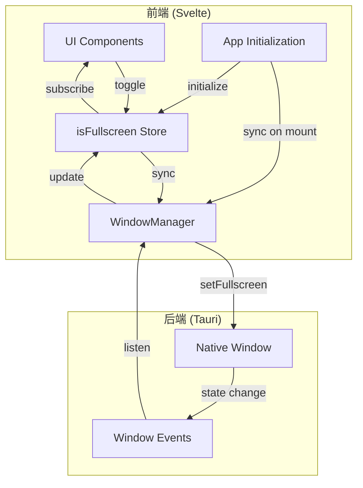
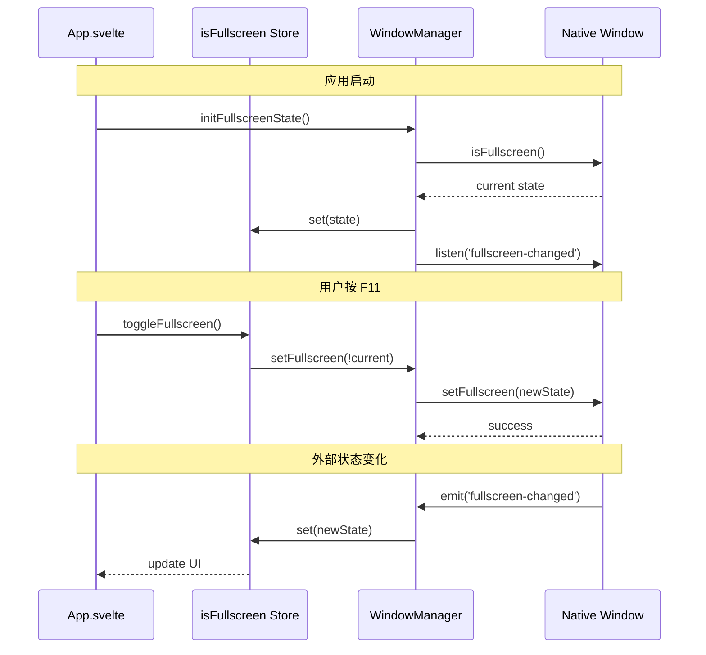

# Design Document: Fullscreen Fix

## Overview

本设计文档描述了修复 NeoView 应用全屏功能的技术方案。主要解决三个核心问题：
1. 首次启动时快捷键无法触发全屏（需要先点击 UI 按钮）
2. 全屏时底部任务栏区域不被覆盖（出现黑边）
3. 全屏时窗口周围有颜色描边

根本原因分析：
- 当前实现中，UI 状态（`isFullscreen` store）和原生窗口状态没有在应用启动时同步
- `toggleFullscreen()` 函数先更新 UI 状态，再异步更新原生窗口状态，但没有处理初始化同步
- 没有监听原生窗口的全屏状态变化事件，导致状态可能不一致

## Architecture



### 状态同步流程



## Components and Interfaces

### 1. WindowManager 扩展

```typescript
// src/lib/core/windows/windowManager.ts

class WindowManager {
    private fullscreenUnlisten: (() => void) | null = null;
    
    /**
     * 初始化全屏状态同步
     * 应在应用启动时调用
     */
    async initFullscreenSync(
        onStateChange: (isFullscreen: boolean) => void
    ): Promise<void>;
    
    /**
     * 获取当前全屏状态并同步到 UI
     */
    async syncFullscreenState(): Promise<boolean>;
    
    /**
     * 清理全屏状态监听器
     */
    cleanupFullscreenSync(): void;
    
    // 现有方法保持不变
    async isFullscreen(): Promise<boolean>;
    async setFullscreen(fullscreen: boolean): Promise<void>;
    async toggleFullscreen(): Promise<boolean>;
}
```

### 2. UI Store 修改

```typescript
// src/lib/stores/ui.svelte.ts

// 修改 toggleFullscreen 函数，确保状态同步
export async function toggleFullscreen(): Promise<void>;

// 新增：设置全屏状态（用于外部同步）
export function setFullscreenState(fullscreen: boolean): void;

// 新增：初始化全屏状态
export async function initFullscreenState(): Promise<void>;
```

### 3. App 初始化修改

```typescript
// src/App.svelte

onMount(async () => {
    // ... 现有初始化代码 ...
    
    // 初始化全屏状态同步
    await initFullscreenState();
});
```

## Data Models

### 全屏状态模型

```typescript
interface FullscreenState {
    // UI 层面的全屏状态
    uiFullscreen: boolean;
    // 原生窗口的全屏状态
    nativeFullscreen: boolean;
    // 是否已初始化
    initialized: boolean;
}
```

### 窗口事件类型

```typescript
// Tauri 窗口事件
type WindowResizedEvent = {
    payload: {
        width: number;
        height: number;
    };
};

// 全屏状态变化回调
type FullscreenChangeCallback = (isFullscreen: boolean) => void;
```

## Correctness Properties

*A property is a characteristic or behavior that should hold true across all valid executions of a system-essentially, a formal statement about what the system should do. Properties serve as the bridge between human-readable specifications and machine-verifiable correctness guarantees.*

### Property 1: Initial State Synchronization
*For any* initial native window fullscreen state (true or false), after the application initialization completes, the UI fullscreen state SHALL equal the native window fullscreen state.
**Validates: Requirements 1.1**

### Property 2: Keyboard Shortcut Independence
*For any* sequence of UI interactions (including zero interactions), pressing the fullscreen keyboard shortcut SHALL toggle the fullscreen state correctly.
**Validates: Requirements 1.2**

### Property 3: State Consistency After Toggle
*For any* fullscreen toggle operation (via keyboard or UI), after the operation completes, the UI fullscreen state SHALL equal the native window fullscreen state.
**Validates: Requirements 1.3, 4.2**

### Property 4: Fullscreen Exit Round-Trip
*For any* window that enters fullscreen mode, exiting fullscreen SHALL restore the window to a valid non-fullscreen state where the native window is not in fullscreen mode.
**Validates: Requirements 2.3**

### Property 5: Bidirectional State Sync
*For any* external fullscreen state change (via OS controls), the UI fullscreen state SHALL be updated to match the native window state within a bounded time.
**Validates: Requirements 4.1, 4.3**

## Error Handling

### 错误场景

1. **原生窗口 API 调用失败**
   - 捕获异常并记录日志
   - 保持 UI 状态不变，避免状态不一致
   - 显示用户友好的错误提示

2. **事件监听器注册失败**
   - 降级到轮询模式检查状态
   - 记录警告日志

3. **状态同步超时**
   - 设置合理的超时时间（如 1000ms）
   - 超时后强制同步状态

### 错误处理代码示例

```typescript
async function safeSetFullscreen(fullscreen: boolean): Promise<boolean> {
    try {
        await windowManager.setFullscreen(fullscreen);
        return true;
    } catch (error) {
        console.error('设置全屏状态失败:', error);
        // 回滚 UI 状态
        const actualState = await windowManager.isFullscreen();
        setFullscreenState(actualState);
        return false;
    }
}
```

## Testing Strategy

### 双重测试方法

本功能采用单元测试和属性测试相结合的方式：

1. **单元测试**：验证具体的边界情况和错误处理
2. **属性测试**：验证状态同步的通用正确性

### 属性测试框架

使用 `fast-check` 作为 TypeScript/JavaScript 的属性测试库。

### 测试用例设计

#### 单元测试

1. **初始化测试**
   - 测试应用启动时状态同步
   - 测试事件监听器正确注册

2. **状态切换测试**
   - 测试 toggleFullscreen 函数
   - 测试 setFullscreen 函数
   - 测试键盘快捷键触发

3. **错误处理测试**
   - 测试 API 调用失败时的回滚
   - 测试超时处理

#### 属性测试

1. **Property 1: Initial State Synchronization**
   - 生成随机初始状态
   - 验证初始化后状态一致

2. **Property 3: State Consistency After Toggle**
   - 生成随机操作序列
   - 验证每次操作后状态一致

3. **Property 4: Fullscreen Exit Round-Trip**
   - 进入全屏后退出
   - 验证状态正确恢复

### 测试文件结构

```
src/lib/core/windows/
├── windowManager.ts
├── windowManager.test.ts      # 单元测试
└── windowManager.property.test.ts  # 属性测试
```

### 属性测试示例

```typescript
import fc from 'fast-check';

describe('Fullscreen State Properties', () => {
    /**
     * Feature: fullscreen-fix, Property 1: Initial State Synchronization
     * Validates: Requirements 1.1
     */
    it('should synchronize UI state with native state on initialization', () => {
        fc.assert(
            fc.property(fc.boolean(), async (initialNativeState) => {
                // Setup: mock native window state
                mockNativeFullscreen(initialNativeState);
                
                // Action: initialize
                await initFullscreenState();
                
                // Assert: UI state matches native state
                const uiState = get(isFullscreen);
                expect(uiState).toBe(initialNativeState);
            }),
            { numRuns: 100 }
        );
    });
});
```
