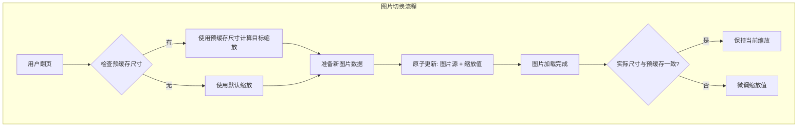
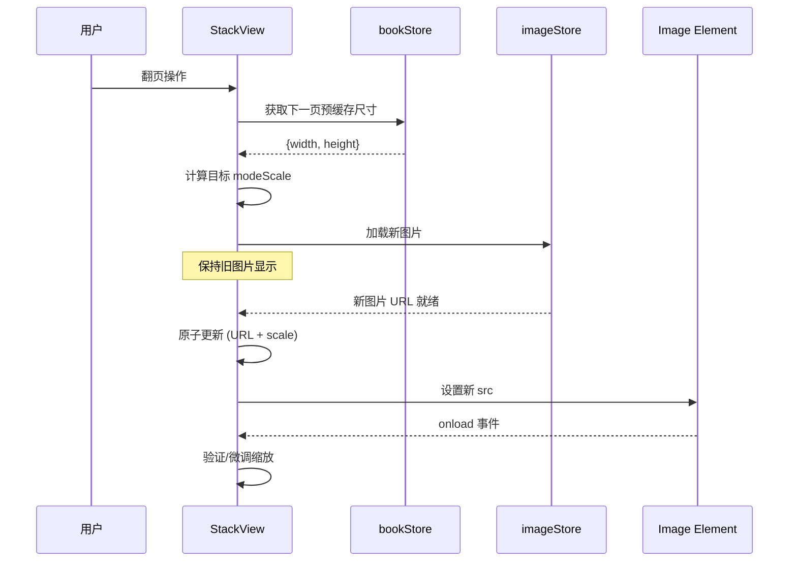

# Design Document: Image Transition Fix

## Overview

本设计文档描述了修复 NeoView 图片查看器在横竖图片切换时视觉跳动问题的技术方案。

### 问题分析

当前实现中存在以下问题：

1. **尺寸信息时序问题**：在 `StackView.svelte` 中，`modeScale` 的计算依赖于多个尺寸来源：
   - `loadedImageSize`：图片加载完成后通过 `onload` 事件获取
   - `imageStore.state.dimensions`：从 imageStore 获取
   - `bookStore.currentPage`：预缓存的页面元数据

2. **状态清空导致跳动**：在 `$effect.pre` 中，当页面索引变化时会清空 `loadedImageSize`：
   ```typescript
   if (pageIndex !== lastPageIndex) {
       loadedImageSize = null;  // 这里清空导致问题
       lastPageIndex = pageIndex;
   }
   ```

3. **缩放计算的级联效应**：当 `loadedImageSize` 被清空后，`modeScale` 会使用 fallback 尺寸，但这些尺寸可能与实际图片尺寸不同，导致缩放值跳动。

### 解决方案

采用"预计算 + 原子切换"策略：

1. **预计算新图片的缩放**：在切换图片前，使用预缓存尺寸计算新图片的目标缩放值
2. **原子切换**：同时更新图片源和缩放值，避免中间状态
3. **延迟清空**：不在页面切换时立即清空 `loadedImageSize`，而是在新图片开始加载时才清空

## Architecture



### 状态管理流程



## Components and Interfaces

### 1. 新增：ImageTransitionManager

```typescript
// src/lib/stackview/utils/imageTransitionManager.ts

interface TransitionState {
    // 目标页面索引
    targetPageIndex: number;
    // 预计算的目标缩放
    targetScale: number;
    // 预缓存的尺寸
    preCachedDimensions: { width: number; height: number } | null;
    // 是否正在过渡中
    isTransitioning: boolean;
}

/**
 * 计算目标缩放值
 * @param dimensions 图片尺寸
 * @param viewport 视口尺寸
 * @param zoomMode 缩放模式
 */
function calculateTargetScale(
    dimensions: { width: number; height: number },
    viewport: { width: number; height: number },
    zoomMode: ZoomMode
): number;

/**
 * 准备图片过渡
 * 在实际切换前调用，预计算目标状态
 */
function prepareTransition(
    targetPageIndex: number,
    preCachedDimensions: { width: number; height: number } | null,
    viewport: { width: number; height: number },
    zoomMode: ZoomMode
): TransitionState;
```

### 2. 修改：StackView.svelte

```typescript
// 关键修改点

// 1. 移除 $effect.pre 中的 loadedImageSize 清空逻辑
// 改为在新图片开始加载时才清空

// 2. 新增过渡状态管理
let transitionState = $state<TransitionState | null>(null);

// 3. 修改 modeScale 计算逻辑
let modeScale = $derived.by(() => {
    // 如果正在过渡中，使用预计算的目标缩放
    if (transitionState?.isTransitioning) {
        return transitionState.targetScale;
    }
    
    // 正常计算逻辑...
});

// 4. 在页面切换时准备过渡
$effect(() => {
    const pageIndex = bookStore.currentPageIndex;
    if (pageIndex !== lastPageIndex) {
        // 获取预缓存尺寸
        const page = bookStore.currentBook?.pages?.[pageIndex];
        const preCached = page ? { width: page.width, height: page.height } : null;
        
        // 准备过渡
        transitionState = prepareTransition(
            pageIndex,
            preCached,
            viewportSize,
            currentZoomMode
        );
        
        lastPageIndex = pageIndex;
    }
});
```

### 3. 修改：StackViewer.svelte

```typescript
// 关键修改点

// 1. 在 navigateToPage 中使用预计算缩放
async function navigateToPage(pageIndex: number) {
    // 获取预缓存尺寸
    const page = bookStore.currentBook?.pages?.[pageIndex];
    if (page?.width && page?.height) {
        // 预计算缩放，避免跳动
        const precomputedScale = computeScale(page.width, page.height);
        // 应用预计算缩放...
    }
    
    // 继续原有逻辑...
}
```

## Data Models

### TransitionState

```typescript
interface TransitionState {
    targetPageIndex: number;
    targetScale: number;
    preCachedDimensions: { width: number; height: number } | null;
    isTransitioning: boolean;
    startTime: number;
}
```

### ImageDimensions

```typescript
interface ImageDimensions {
    width: number;
    height: number;
    source: 'preCache' | 'loaded' | 'default';
}
```

## Correctness Properties

*A property is a characteristic or behavior that should hold true across all valid executions of a system-essentially, a formal statement about what the system should do. Properties serve as the bridge between human-readable specifications and machine-verifiable correctness guarantees.*

### Property 1: Pre-cached Dimensions Usage
*For any* image transition where pre-cached dimensions are available, the initial scale calculation SHALL use those pre-cached dimensions without waiting for image load.
**Validates: Requirements 1.1, 1.2, 3.2**

### Property 2: Transition Atomicity
*For any* image transition, the scale value and image source SHALL be updated atomically, with no intermediate scale values being rendered.
**Validates: Requirements 2.1, 2.2, 2.3**

### Property 3: Aspect Ratio Change Correctness
*For any* transition between images with different aspect ratios (horizontal to vertical or vice versa), the new image SHALL be displayed at its correct scale immediately upon transition.
**Validates: Requirements 4.1, 4.2, 4.3**

### Property 4: Post-load Scale Verification
*For any* image that finishes loading, if the actual dimensions differ from pre-cached dimensions, the scale SHALL be adjusted to match the actual dimensions.
**Validates: Requirements 1.3**

### Property 5: Preload Utilization
*For any* image that has been preloaded by the image pool, the transition SHALL use the preloaded data immediately without additional loading delay.
**Validates: Requirements 3.3**

## Error Handling

### 错误场景

1. **预缓存尺寸不可用**
   - 使用默认缩放值 (1.0)
   - 等待图片加载后更新缩放

2. **预缓存尺寸与实际尺寸不匹配**
   - 图片加载完成后检测差异
   - 如果差异超过阈值（如 5%），平滑过渡到正确缩放

3. **图片加载失败**
   - 保持当前显示状态
   - 显示错误提示

### 错误处理代码示例

```typescript
function handleDimensionMismatch(
    preCached: { width: number; height: number },
    actual: { width: number; height: number }
): void {
    const widthDiff = Math.abs(preCached.width - actual.width) / actual.width;
    const heightDiff = Math.abs(preCached.height - actual.height) / actual.height;
    
    // 如果差异超过 5%，需要调整
    if (widthDiff > 0.05 || heightDiff > 0.05) {
        console.warn('预缓存尺寸与实际尺寸不匹配，调整缩放');
        // 平滑过渡到正确缩放
        animateToCorrectScale(actual);
    }
}
```

## Testing Strategy

### 双重测试方法

本功能采用单元测试和属性测试相结合的方式：

1. **单元测试**：验证具体的边界情况和错误处理
2. **属性测试**：验证缩放计算和过渡的通用正确性

### 属性测试框架

使用 `fast-check` 作为 TypeScript/JavaScript 的属性测试库。

### 测试用例设计

#### 单元测试

1. **缩放计算测试**
   - 测试各种 zoomMode 下的缩放计算
   - 测试横向/竖向图片的缩放差异

2. **过渡状态测试**
   - 测试过渡状态的创建和清理
   - 测试原子更新逻辑

3. **错误处理测试**
   - 测试预缓存尺寸不可用的情况
   - 测试尺寸不匹配的处理

#### 属性测试

1. **Property 1: Pre-cached Dimensions Usage**
   - 生成随机预缓存尺寸
   - 验证缩放计算使用预缓存尺寸

2. **Property 3: Aspect Ratio Change Correctness**
   - 生成随机横向/竖向图片尺寸对
   - 验证切换后缩放正确

### 测试文件结构

```
src/lib/stackview/utils/
├── imageTransitionManager.ts
├── imageTransitionManager.test.ts      # 单元测试
└── imageTransitionManager.property.test.ts  # 属性测试
```

### 属性测试示例

```typescript
import fc from 'fast-check';

describe('Image Transition Properties', () => {
    /**
     * Feature: image-transition-fix, Property 1: Pre-cached Dimensions Usage
     * Validates: Requirements 1.1, 1.2, 3.2
     */
    it('should use pre-cached dimensions for initial scale calculation', () => {
        fc.assert(
            fc.property(
                fc.record({
                    width: fc.integer({ min: 100, max: 4000 }),
                    height: fc.integer({ min: 100, max: 4000 })
                }),
                fc.record({
                    width: fc.integer({ min: 100, max: 2000 }),
                    height: fc.integer({ min: 100, max: 2000 })
                }),
                (preCachedDims, viewport) => {
                    const state = prepareTransition(0, preCachedDims, viewport, 'fit');
                    
                    // 验证使用了预缓存尺寸计算缩放
                    const expectedScale = calculateTargetScale(preCachedDims, viewport, 'fit');
                    expect(state.targetScale).toBe(expectedScale);
                }
            ),
            { numRuns: 100 }
        );
    });

    /**
     * Feature: image-transition-fix, Property 3: Aspect Ratio Change Correctness
     * Validates: Requirements 4.1, 4.2, 4.3
     */
    it('should calculate correct scale for aspect ratio changes', () => {
        fc.assert(
            fc.property(
                // 横向图片
                fc.record({
                    width: fc.integer({ min: 1000, max: 4000 }),
                    height: fc.integer({ min: 100, max: 999 })
                }),
                // 竖向图片
                fc.record({
                    width: fc.integer({ min: 100, max: 999 }),
                    height: fc.integer({ min: 1000, max: 4000 })
                }),
                fc.record({
                    width: fc.integer({ min: 800, max: 1920 }),
                    height: fc.integer({ min: 600, max: 1080 })
                }),
                (horizontal, vertical, viewport) => {
                    // 从横向切换到竖向
                    const scaleForVertical = calculateTargetScale(vertical, viewport, 'fit');
                    
                    // 验证缩放值正确（适应视口）
                    const expectedScale = Math.min(
                        viewport.width / vertical.width,
                        viewport.height / vertical.height
                    );
                    expect(Math.abs(scaleForVertical - expectedScale)).toBeLessThan(0.001);
                }
            ),
            { numRuns: 100 }
        );
    });
});
```

