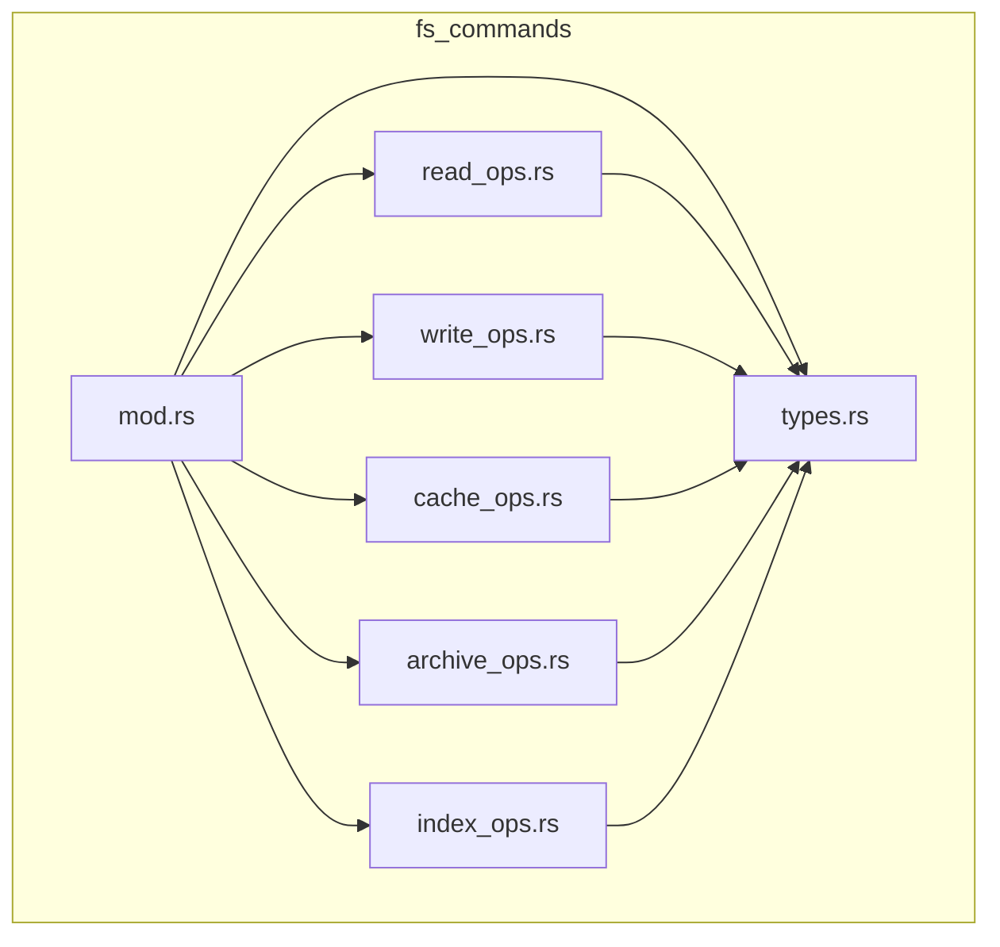

# Design Document: Large File Refactor

## Overview

本设计文档描述了将 NeoView 项目中 7 个超过 800 行的 Rust 源文件重构为模块化结构的详细方案。重构遵循 Rust 的模块系统最佳实践，将每个大文件拆分为一个同名目录，包含多个职责单一的子模块。

## Architecture

### 重构策略

采用"目录模块"模式：
1. 将原文件 `xxx.rs` 重命名为 `xxx/mod.rs`
2. 将相关功能提取到同目录下的子模块
3. 在 `mod.rs` 中使用 `pub use` 重新导出所有公共 API
4. 保持原有的导入路径不变

```
重构前:
src/commands/fs_commands.rs (2096 lines)

重构后:
src/commands/fs_commands/
├── mod.rs          (~200 lines) - 模块入口、状态定义、重导出
├── types.rs        (~100 lines) - 共享类型定义
├── read_ops.rs     (~400 lines) - 读取操作
├── write_ops.rs    (~300 lines) - 写入操作
├── cache_ops.rs    (~400 lines) - 缓存操作
├── archive_ops.rs  (~400 lines) - 压缩包操作
└── index_ops.rs    (~300 lines) - 索引操作
```

### 模块依赖关系



## Components and Interfaces

### 1. fs_commands 模块拆分

**原文件**: `src-tauri/src/commands/fs_commands.rs` (2096 行)

| 子模块 | 职责 | 预估行数 |
|--------|------|----------|
| `mod.rs` | 模块入口、状态结构体、重导出 | ~150 |
| `types.rs` | FileInfo, SubfolderItem, DirectorySnapshotResponse 等类型 | ~100 |
| `read_ops.rs` | read_directory, get_file_info, browse_directory, list_subfolders 等 | ~400 |
| `write_ops.rs` | create_directory, delete_path, rename_path, copy_path, move_path 等 | ~250 |
| `cache_ops.rs` | load_directory_snapshot, batch_load_directory_snapshots, cache_index_* | ~400 |
| `archive_ops.rs` | list_archive_contents, load_image_from_archive_*, extract_* 等 | ~500 |
| `index_ops.rs` | search_files, build_file_index, search_in_index 等 | ~300 |

**公共 API 保持**:
```rust
// mod.rs 中重导出
pub use types::*;
pub use read_ops::*;
pub use write_ops::*;
pub use cache_ops::*;
pub use archive_ops::*;
pub use index_ops::*;
```

### 2. thumbnail_db 模块拆分

**原文件**: `src-tauri/src/core/thumbnail_db.rs` (1976 行)

| 子模块 | 职责 | 预估行数 |
|--------|------|----------|
| `mod.rs` | ThumbnailDb 主结构、连接管理、重导出 | ~300 |
| `types.rs` | CompressionStats, ThumbnailDbStats, ThumbnailDbRecord | ~80 |
| `compression.rs` | LZ4 压缩/解压函数 | ~100 |
| `schema.rs` | 数据库初始化、迁移、表结构 | ~250 |
| `crud.rs` | save_thumbnail, load_thumbnail, has_thumbnail 等基本 CRUD | ~400 |
| `batch_ops.rs` | batch_save, batch_load, batch_check 等批量操作 | ~300 |
| `emm_ops.rs` | EMM JSON 相关操作 | ~250 |
| `rating_ops.rs` | rating_data 相关操作 | ~200 |
| `maintenance.rs` | vacuum, cleanup, normalize 等维护操作 | ~150 |

### 3. benchmark_commands 模块拆分

**原文件**: `src-tauri/src/commands/benchmark_commands.rs` (1610 行)

| 子模块 | 职责 | 预估行数 |
|--------|------|----------|
| `mod.rs` | 模块入口、重导出 | ~50 |
| `types.rs` | BenchmarkResult, BenchmarkReport, DetailedBenchmarkResult 等 | ~100 |
| `image_benchmark.rs` | run_image_benchmark, test_load_modes | ~350 |
| `thumbnail_benchmark.rs` | 缩略图生成相关基准测试 | ~300 |
| `archive_benchmark.rs` | run_archive_thumbnail_benchmark, run_archive_folder_benchmark | ~350 |
| `wic_benchmark.rs` | WIC + LZ4 相关测试 | ~250 |
| `realworld_benchmark.rs` | run_realworld_benchmark | ~200 |

### 4. archive 模块拆分

**原文件**: `src-tauri/src/core/archive.rs` (1457 行)

| 子模块 | 职责 | 预估行数 |
|--------|------|----------|
| `mod.rs` | ArchiveManager 主结构、重导出 | ~200 |
| `types.rs` | ArchiveFormat, ArchiveEntry, ArchiveMetadata | ~100 |
| `format.rs` | 格式检测、扩展名常量 | ~80 |
| `zip_handler.rs` | ZIP/CBZ 格式处理 | ~300 |
| `rar_handler.rs` | RAR/CBR 格式处理 | ~250 |
| `sevenz_handler.rs` | 7Z/CB7 格式处理 | ~250 |
| `image_ops.rs` | 图片加载、JXL 转换 | ~200 |
| `cache.rs` | 缓存管理 | ~100 |

### 5. thumbnail_commands 模块拆分

**原文件**: `src-tauri/src/commands/thumbnail_commands.rs` (1295 行)

| 子模块 | 职责 | 预估行数 |
|--------|------|----------|
| `mod.rs` | ThumbnailState、init_thumbnail_manager、重导出 | ~150 |
| `types.rs` | ThumbnailIndexRequest, ThumbnailIndexResult 等 | ~80 |
| `generation.rs` | generate_*_thumbnail_new 命令 | ~300 |
| `retrieval.rs` | load_thumbnail_from_db, get_thumbnail_blob_data 等 | ~250 |
| `batch_ops.rs` | batch_preload_thumbnails, batch_load_thumbnails_from_db | ~200 |
| `emm_commands.rs` | EMM JSON 相关命令 | ~150 |
| `rating_commands.rs` | rating_data 相关命令 | ~100 |
| `maintenance_commands.rs` | 维护相关命令 | ~100 |

### 6. thumbnail_service_v3 模块拆分

**原文件**: `src-tauri/src/core/thumbnail_service_v3.rs` (1353 行)

| 子模块 | 职责 | 预估行数 |
|--------|------|----------|
| `mod.rs` | ThumbnailServiceV3 主结构、重导出 | ~250 |
| `config.rs` | ThumbnailServiceConfig | ~80 |
| `types.rs` | ThumbnailFileType, GenerateTask, Payload 类型 | ~100 |
| `worker.rs` | 工作线程管理、任务处理 | ~350 |
| `queue.rs` | 任务队列管理 | ~150 |
| `cache.rs` | LRU 内存缓存管理 | ~200 |
| `db_index.rs` | 数据库索引管理 | ~150 |
| `generators.rs` | 静态生成方法 | ~150 |

### 7. upscale_service 模块拆分

**原文件**: `src-tauri/src/core/upscale_service.rs` (1249 行)

| 子模块 | 职责 | 预估行数 |
|--------|------|----------|
| `mod.rs` | UpscaleService 主结构、重导出 | ~200 |
| `config.rs` | UpscaleServiceConfig | ~50 |
| `types.rs` | UpscaleStatus, TaskPriority, TaskScore, UpscaleTask | ~150 |
| `events.rs` | UpscaleReadyPayload, UpscaleServiceStats | ~80 |
| `worker.rs` | 工作线程管理 | ~300 |
| `queue.rs` | 任务队列、优先级管理 | ~200 |
| `conditions.rs` | 条件匹配逻辑 | ~150 |
| `cache.rs` | 文件缓存管理 | ~150 |

## Data Models

### 模块结构示例

```rust
// src-tauri/src/commands/fs_commands/mod.rs
//! 文件系统命令模块
//! 
//! 提供文件系统操作相关的 Tauri 命令

mod types;
mod read_ops;
mod write_ops;
mod cache_ops;
mod archive_ops;
mod index_ops;

// 重导出所有公共 API
pub use types::*;
pub use read_ops::*;
pub use write_ops::*;
pub use cache_ops::*;
pub use archive_ops::*;
pub use index_ops::*;

// 状态结构体保留在 mod.rs
use std::sync::{Arc, Mutex};
use crate::core::{ArchiveManager, FsManager};
use crate::core::directory_cache::DirectoryCache;
use crate::core::cache_index_db::CacheIndexDb;

/// 文件系统状态
pub struct FsState {
    pub fs_manager: Arc<Mutex<FsManager>>,
    pub archive_manager: Arc<Mutex<ArchiveManager>>,
}

/// 目录缓存状态（内存 LRU）
pub struct DirectoryCacheState {
    pub cache: Mutex<DirectoryCache>,
}

/// 缓存索引状态（SQLite）
pub struct CacheIndexState {
    pub db: Arc<CacheIndexDb>,
}
```

## Correctness Properties

*A property is a characteristic or behavior that should hold true across all valid executions of a system-essentially, a formal statement about what the system should do. Properties serve as the bridge between human-readable specifications and machine-verifiable correctness guarantees.*

### Property 1: 文件行数限制

*For any* 重构后的模块文件，其行数应不超过 800 行。

**Validates: Requirements 1.1**

### Property 2: 编译正确性

*For any* 重构操作完成后，项目应能通过 `cargo check` 编译检查，无错误。

**Validates: Requirements 12.1**

### Property 3: API 兼容性

*For any* 原有的公共 API 调用，重构后应保持相同的函数签名和导入路径。

**Validates: Requirements 3.1, 3.2, 3.3**

## Error Handling

### 重构过程中的错误处理

1. **编译错误**: 每完成一个模块拆分后立即运行 `cargo check`，确保无编译错误
2. **导入错误**: 使用 `pub use` 确保所有公共 API 可从原路径访问
3. **循环依赖**: 将共享类型提取到 `types.rs`，避免模块间循环依赖

### 回滚策略

如果重构导致问题：
1. 使用 Git 版本控制回滚到重构前状态
2. 逐个模块重新拆分，每次拆分后验证

## Testing Strategy

### 验证方法

1. **编译验证**: 每个模块拆分后运行 `cargo check`
2. **行数验证**: 使用脚本检查所有新模块文件行数 ≤ 800
3. **功能验证**: 运行现有测试确保功能不变
4. **最终验证**: 运行 `yarn check` 确保整体项目正常

### 验证脚本

```bash
# 检查所有 Rust 文件行数
find src-tauri/src -name "*.rs" -exec wc -l {} \; | awk '$1 > 800 {print "WARNING: " $2 " has " $1 " lines"}'

# 编译检查
cd src-tauri && cargo check

# 完整检查
yarn check
```

### 测试顺序

1. 先重构最独立的模块（如 `types.rs`）
2. 逐步拆分功能模块
3. 每次拆分后验证编译
4. 全部完成后运行完整测试
