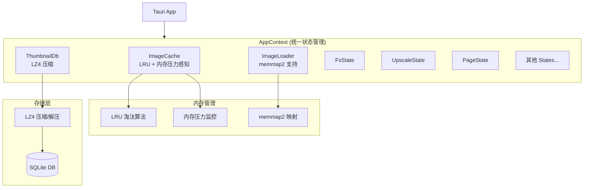

# Design Document: Memory & State Architecture Improvements

## Overview

本设计文档描述了 NeoView 应用程序的内存管理和状态管理架构改进方案。主要目标是：

1. 将 ImageCache 从固定 MB 限制改为 LRU + 内存压力感知
2. 使用 memmap2 实现大图内存映射加载
3. 使用 LZ4 压缩缩略图 blob 存储
4. 引入 AppContext 统一管理 15+ 个独立 State
5. 使用 Arc<RwLock<>> 替代部分 Mutex 提升读并发

## Architecture



## Components and Interfaces

### 1. LruImageCache (新组件)

替换现有的 `ImageCache`，实现 LRU 淘汰和内存压力感知。

```rust
/// LRU 图像缓存管理器
pub struct LruImageCache {
    /// LRU 缓存 (key -> CacheEntry)
    cache: Arc<RwLock<LruCache<String, CacheEntry>>>,
    /// 最大缓存大小 (字节)
    max_size: AtomicUsize,
    /// 当前缓存大小
    current_size: AtomicUsize,
    /// 内存压力阈值 (可用内存百分比)
    memory_pressure_threshold: AtomicU8,
}

impl LruImageCache {
    /// 创建新的 LRU 缓存
    pub fn new(max_size_mb: usize, memory_pressure_threshold: u8) -> Self;
    
    /// 获取缓存项 (更新 LRU 顺序)
    pub fn get(&self, key: &str) -> Option<CacheEntry>;
    
    /// 设置缓存项
    pub fn set(&self, key: String, data: CacheEntry);
    
    /// 检查并响应内存压力
    pub fn check_memory_pressure(&self) -> bool;
    
    /// 强制淘汰指定数量的条目
    pub fn evict(&self, count: usize) -> usize;
    
    /// 获取缓存统计
    pub fn stats(&self) -> CacheStats;
}
```

### 2. MmapImageLoader (增强 ImageLoader)

增强现有的 `ImageLoader`，支持大图内存映射。

```rust
impl ImageLoader {
    /// 大文件阈值 (默认 10MB)
    const DEFAULT_LARGE_FILE_THRESHOLD: u64 = 10 * 1024 * 1024;
    
    /// 加载图像 (自动选择加载方式)
    pub fn load_image(&self, path: &Path) -> Result<ImageData, ImageError>;
    
    /// 使用内存映射加载大图
    fn load_with_mmap(&self, path: &Path) -> Result<ImageData, ImageError>;
    
    /// 传统方式加载图像
    fn load_traditional(&self, path: &Path) -> Result<ImageData, ImageError>;
    
    /// 设置大文件阈值
    pub fn set_large_file_threshold(&mut self, threshold: u64);
}
```

### 3. Lz4ThumbnailDb (增强 ThumbnailDb)

增强现有的 `ThumbnailDb`，支持 LZ4 压缩。

```rust
impl ThumbnailDb {
    /// 保存缩略图 (自动 LZ4 压缩)
    pub fn save_thumbnail_compressed(
        &self,
        key: &str,
        size: i64,
        ghash: i32,
        thumbnail_data: &[u8],
    ) -> SqliteResult<()>;
    
    /// 加载缩略图 (自动 LZ4 解压)
    pub fn load_thumbnail_compressed(
        &self,
        key: &str,
    ) -> SqliteResult<Option<Vec<u8>>>;
    
    /// 获取压缩统计
    pub fn get_compression_stats(&self) -> CompressionStats;
}

#[derive(Debug, Clone)]
pub struct CompressionStats {
    pub total_entries: u64,
    pub compressed_size_bytes: u64,
    pub uncompressed_size_bytes: u64,
    pub compression_ratio: f64,
}
```

### 4. AppContext (新组件)

统一状态管理上下文。

```rust
/// 应用上下文 - 统一状态管理
pub struct AppContext {
    /// 图像缓存
    pub image_cache: Arc<RwLock<LruImageCache>>,
    /// 图像加载器
    pub image_loader: Arc<RwLock<ImageLoader>>,
    /// 缩略图数据库
    pub thumbnail_db: Arc<ThumbnailDb>,
    /// 文件系统管理器
    pub fs_manager: Arc<RwLock<FsManager>>,
    /// 压缩包管理器
    pub archive_manager: Arc<RwLock<ArchiveManager>>,
    /// 超分管理器
    pub upscale_manager: Arc<RwLock<Option<UpscaleManager>>>,
    /// 页面管理器
    pub page_manager: Arc<tokio::sync::RwLock<PageContentManager>>,
    /// 后台任务调度器
    pub background_scheduler: Arc<BackgroundTaskScheduler>,
    /// 目录缓存
    pub directory_cache: Arc<RwLock<DirectoryCache>>,
    /// 缓存索引数据库
    pub cache_index_db: Arc<CacheIndexDb>,
    /// 尺寸扫描器
    pub dimension_scanner: Arc<DimensionScannerState>,
    /// Blob 注册表
    pub blob_registry: Arc<BlobRegistry>,
    /// 配置
    config: AppConfig,
}

impl AppContext {
    /// 创建应用上下文
    pub fn new(app_data_root: PathBuf, config: AppConfig) -> Self;
    
    /// 获取所有管理的状态名称
    pub fn list_managed_states(&self) -> Vec<&'static str>;
    
    /// 序列化配置
    pub fn serialize_config(&self) -> Result<String, serde_json::Error>;
    
    /// 从配置反序列化
    pub fn deserialize_config(json: &str) -> Result<AppConfig, serde_json::Error>;
}

#[derive(Debug, Clone, Serialize, Deserialize)]
pub struct AppConfig {
    pub cache_size_mb: usize,
    pub memory_pressure_threshold: u8,
    pub large_file_threshold_mb: u64,
    pub thumbnail_compression_enabled: bool,
}
```

## Data Models

### CacheEntry

```rust
#[derive(Clone, Debug)]
pub struct CacheEntry {
    /// 图片数据 (base64 或文件URL)
    pub data: String,
    /// 数据大小 (字节)
    pub size: usize,
    /// 是否为文件URL
    pub is_file_url: bool,
    /// 创建时间戳
    pub created_at: u64,
}
```

### CacheStats

```rust
#[derive(Debug, Clone, Serialize)]
pub struct CacheStats {
    /// 缓存条目数
    pub entry_count: usize,
    /// 当前大小 (字节)
    pub current_size: usize,
    /// 最大大小 (字节)
    pub max_size: usize,
    /// 命中次数
    pub hits: u64,
    /// 未命中次数
    pub misses: u64,
    /// 淘汰次数
    pub evictions: u64,
}
```

### ImageData

```rust
#[derive(Debug)]
pub struct ImageData {
    /// 图像宽度
    pub width: u32,
    /// 图像高度
    pub height: u32,
    /// 图像格式
    pub format: ImageFormat,
    /// 原始数据 (可能是 mmap 或 Vec)
    pub data: ImageDataSource,
}

pub enum ImageDataSource {
    /// 内存中的数据
    Memory(Vec<u8>),
    /// 内存映射的数据
    Mmap(memmap2::Mmap),
}
```

## Correctness Properties

*A property is a characteristic or behavior that should hold true across all valid executions of a system-essentially, a formal statement about what the system should do. 
Properties serve as the bridge between human-readable specifications and machine-verifiable correctness guarantees.*

Based on the prework analysis, the following properties have been identified. Redundant properties have been consolidated.

### Property 1: LRU Eviction Order
*For any* sequence of cache insertions and accesses that exceeds the cache capacity, the evicted entries SHALL be those with the oldest access timestamps (least recently used).
**Validates: Requirements 1.1, 1.3, 1.4**

### Property 2: Memory Pressure Eviction
*For any* simulated memory pressure event, the cache SHALL reduce its size by evicting entries until memory usage falls below the threshold.
**Validates: Requirements 1.2**

### Property 3: Cache Entry Round-Trip
*For any* valid CacheEntry, serializing then deserializing SHALL produce an equivalent entry with identical data, size, and is_file_url fields.
**Validates: Requirements 1.6**

### Property 4: Large File Threshold Loading
*For any* image file, if the file size exceeds the configured threshold, the ImageLoader SHALL use memory-mapped loading; otherwise, it SHALL use traditional loading.
**Validates: Requirements 2.1**

### Property 5: Mmap Dimension Consistency
*For any* image file, loading via memory-mapping SHALL report the same width and height as loading via traditional method.
**Validates: Requirements 2.4**

### Property 6: Thumbnail Compression Round-Trip
*For any* valid thumbnail blob data, compressing with LZ4 then decompressing SHALL produce data byte-for-byte identical to the original.
**Validates: Requirements 3.1, 3.2, 3.5**

### Property 7: Concurrent Read Access
*For any* number of concurrent reader threads (up to a reasonable limit), all readers SHALL be able to access the cache simultaneously without blocking each other.
**Validates: Requirements 4.3, 5.1**

### Property 8: Write Exclusivity
*For any* write operation, no other read or write operations SHALL execute concurrently with the write.
**Validates: Requirements 4.4, 5.2, 5.4, 5.5**

### Property 9: AppContext Config Round-Trip
*For any* valid AppConfig, serializing to JSON then deserializing SHALL produce an equivalent configuration.
**Validates: Requirements 4.5**

## Error Handling

### ImageCache Errors

| Error | Handling Strategy |
|-------|-------------------|
| 内存分配失败 | 触发紧急淘汰，释放 50% 缓存空间 |
| LRU 数据结构损坏 | 清空缓存并重新初始化 |
| 内存压力检测失败 | 使用默认阈值继续运行 |

### ImageLoader Errors

| Error | Handling Strategy |
|-------|-------------------|
| memmap2 映射失败 | 回退到传统加载方式 |
| 文件不存在 | 返回 FileNotFound 错误 |
| 图像解码失败 | 返回 DecodeError 错误 |

### ThumbnailDb Errors

| Error | Handling Strategy |
|-------|-------------------|
| LZ4 压缩失败 | 存储未压缩数据并记录警告 |
| LZ4 解压失败 | 返回错误，可能需要重新生成缩略图 |
| SQLite 写入失败 | 重试 3 次后返回错误 |

## Testing Strategy

### Property-Based Testing Library

使用 **proptest** 作为 Rust 的属性测试库。

### Unit Tests

1. **LruImageCache 单元测试**
   - 测试基本的 get/set 操作
   - 测试 LRU 淘汰顺序
   - 测试内存压力响应

2. **ImageLoader 单元测试**
   - 测试阈值判断逻辑
   - 测试 mmap 回退逻辑
   - 测试尺寸报告一致性

3. **ThumbnailDb 单元测试**
   - 测试压缩/解压功能
   - 测试统计信息准确性
   - 测试错误处理路径

4. **AppContext 单元测试**
   - 测试初始化完整性
   - 测试状态列表
   - 测试配置序列化

### Property-Based Tests

每个属性测试必须：
- 使用 proptest 库
- 配置至少 100 次迭代
- 使用注释标记对应的 correctness property
- 格式: `**Feature: memory-state-architecture, Property {number}: {property_text}**`

### Integration Tests

1. **端到端缓存测试** - 验证完整的缓存生命周期
2. **并发访问测试** - 验证多线程安全性
3. **内存压力模拟测试** - 验证系统在低内存条件下的行为
