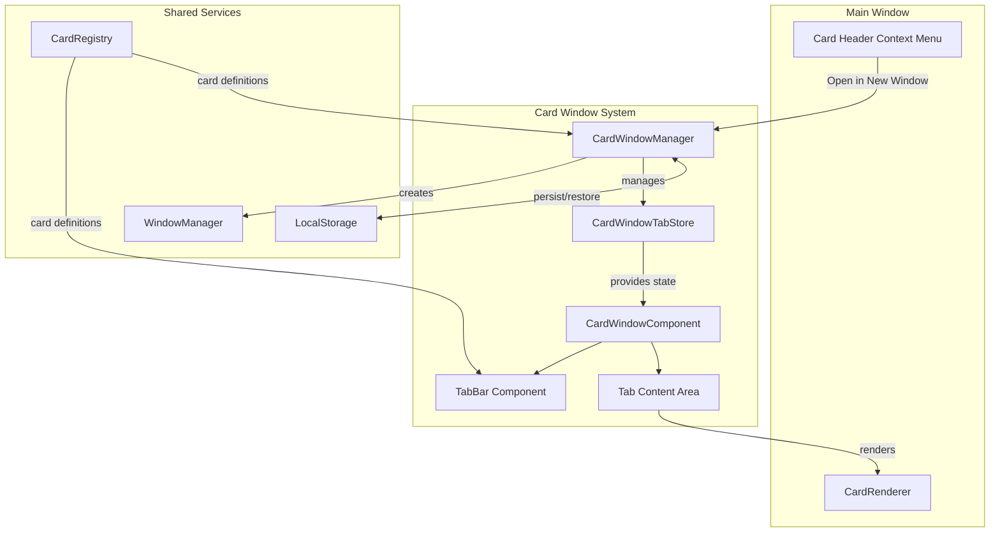

# Design Document: Multi-Window Card Tabs

## Overview

本设计实现 NeoView 的多窗口卡片标签页系统，允许用户将任意卡片在独立窗口中以标签页形式打开和管理。系统基于现有的 `WindowManager`、`CardRegistry` 和 `CardRenderer` 进行扩展，新增 `CardWindowTabStore` 管理窗口内标签页状态，并通过 Tauri 的 `WebviewWindow` API 实现多窗口支持。

## Architecture



## Components and Interfaces

### 1. CardWindowManager

扩展现有 `WindowManager`，专门管理卡片窗口的生命周期。

```typescript
// src/lib/core/windows/cardWindowManager.ts

export interface CardWindowConfig {
  windowId: string;
  label: string;
  tabs: CardTabConfig[];
  activeTabId: string;
  position?: { x: number; y: number };
  size?: { width: number; height: number };
  createdAt: number;
}

export interface CardTabConfig {
  tabId: string;
  cardId: string;
  title: string;
  order: number;
}

export interface CardWindowManager {
  // 创建新卡片窗口
  createCardWindow(cardId: string): Promise<string | null>;
  
  // 向现有窗口添加标签页
  addTabToWindow(windowId: string, cardId: string): void;
  
  // 关闭窗口
  closeCardWindow(windowId: string): Promise<void>;
  
  // 获取所有卡片窗口配置
  getAllCardWindows(): CardWindowConfig[];
  
  // 持久化配置
  saveConfigs(): void;
  
  // 恢复窗口
  restoreWindows(): Promise<void>;
  
  // 跨窗口移动标签页
  moveTabBetweenWindows(
    sourceWindowId: string, 
    targetWindowId: string, 
    tabId: string
  ): void;
}
```

### 2. CardWindowTabStore

管理单个卡片窗口内的标签页状态，使用 Svelte 5 Runes。

```typescript
// src/lib/stores/cardWindowTabStore.svelte.ts

export interface CardTab {
  id: string;
  cardId: string;
  title: string;
  icon?: Component;
  order: number;
}

export interface CardWindowTabState {
  windowId: string;
  tabs: CardTab[];
  activeTabId: string;
}

export class CardWindowTabStore {
  // 响应式状态
  tabs: CardTab[];
  activeTabId: string;
  
  // 标签页操作
  addTab(cardId: string): string;
  removeTab(tabId: string): void;
  setActiveTab(tabId: string): void;
  moveTab(tabId: string, newOrder: number): void;
  duplicateTab(tabId: string): string;
  
  // 导航
  nextTab(): void;
  previousTab(): void;
  
  // 序列化
  toConfig(): CardTabConfig[];
  static fromConfig(config: CardTabConfig[]): CardWindowTabStore;
}
```

### 3. CardWindow Component

独立窗口的主组件，包含标签栏和内容区域。

```typescript
// src/routes/cardwindow/[windowId]/+page.svelte

interface CardWindowProps {
  windowId: string;
}

// 组件结构:
// - TitleBar (窗口控制)
// - TabBar (标签栏 + 添加按钮)
// - TabContent (CardRenderer)
```

### 4. TabBar Component

标签栏组件，支持拖拽排序和跨窗口拖拽。

```typescript
// src/lib/components/cardwindow/TabBar.svelte

interface TabBarProps {
  tabs: CardTab[];
  activeTabId: string;
  onTabClick: (tabId: string) => void;
  onTabClose: (tabId: string) => void;
  onTabReorder: (tabId: string, newOrder: number) => void;
  onAddCard: () => void;
  onTabDragOut: (tabId: string) => void;
}
```

### 5. CardHeaderContextMenu

卡片头部右键菜单，添加"在新窗口打开"选项。

```typescript
// src/lib/components/cards/CardHeaderContextMenu.svelte

interface CardHeaderContextMenuProps {
  cardId: string;
  panelId: PanelId;
  onOpenInNewWindow: () => void;
}
```

## Data Models

### CardWindowConfig (持久化)

```typescript
interface PersistedCardWindowConfig {
  version: number;
  windows: {
    windowId: string;
    tabs: {
      tabId: string;
      cardId: string;
      order: number;
    }[];
    activeTabId: string;
    bounds?: {
      x: number;
      y: number;
      width: number;
      height: number;
    };
  }[];
}
```

### 存储键

```typescript
const STORAGE_KEY = 'neoview_card_windows_v1';
```

## Correctness Properties

*A property is a characteristic or behavior that should hold true across all valid executions of a system-essentially, a formal statement about what the system should do. Properties serve as the bridge between human-readable specifications and machine-verifiable correctness guarantees.*

Based on the prework analysis, the following properties have been identified:

### Property 1: Window creation contains requested card
*For any* valid card ID from CardRegistry, when creating a new card window, the resulting window configuration SHALL contain exactly one tab with that card ID.
**Validates: Requirements 1.2**

### Property 2: Tab store state consistency
*For any* CardWindowTabStore with N tabs (N > 0), the activeTabId SHALL always reference a tab that exists in the tabs array.
**Validates: Requirements 2.1, 2.2**

### Property 3: Tab closure maintains valid state
*For any* CardWindowTabStore with N tabs (N > 1), closing a tab SHALL result in N-1 tabs and the activeTabId SHALL reference an existing tab.
**Validates: Requirements 2.3**

### Property 4: Tab reordering preserves all tabs
*For any* CardWindowTabStore, reordering a tab from position A to position B SHALL preserve all tab IDs and result in correct sequential ordering.
**Validates: Requirements 2.5**

### Property 5: Add card increases tab count
*For any* CardWindowTabStore with N tabs and any valid card ID, adding a new tab SHALL result in N+1 tabs with the new tab being active.
**Validates: Requirements 3.3**

### Property 6: Available cards match registry
*For any* card selection dropdown, the list of available cards SHALL equal the set of all card IDs in CardRegistry.
**Validates: Requirements 3.2**

### Property 7: Cross-window tab transfer preserves count
*For any* two CardWindowTabStores with M and N tabs respectively, moving a tab from source to target SHALL result in M-1 and N+1 tabs.
**Validates: Requirements 4.2**

### Property 8: Tab transfer preserves card identity
*For any* tab moved between windows, the card ID and configuration SHALL remain unchanged after transfer.
**Validates: Requirements 4.3**

### Property 9: Persistence round-trip consistency
*For any* CardWindowConfig, serializing to localStorage and deserializing SHALL produce an equivalent configuration.
**Validates: Requirements 5.1, 5.2**

### Property 10: Restoration filters invalid cards
*For any* persisted configuration containing card IDs not in CardRegistry, restoration SHALL filter out those invalid tabs while preserving valid ones.
**Validates: Requirements 5.4**

### Property 11: Tab cycling wraps correctly
*For any* CardWindowTabStore with N tabs at active index i, calling nextTab SHALL set active index to (i+1) mod N.
**Validates: Requirements 6.2**

### Property 12: Reverse tab cycling wraps correctly
*For any* CardWindowTabStore with N tabs at active index i, calling previousTab SHALL set active index to (i-1+N) mod N.
**Validates: Requirements 6.3**

### Property 13: Drag cancel preserves order
*For any* drag operation that is cancelled, the tab order SHALL be identical to the order before the drag started.
**Validates: Requirements 7.4**

### Property 14: Tab duplication creates new ID
*For any* tab duplication, the new tab SHALL have the same cardId but a different tabId from the original.
**Validates: Requirements 8.2, 8.3**

## Error Handling

### Window Creation Failures

```typescript
try {
  const window = await cardWindowManager.createCardWindow(cardId);
  if (!window) {
    toast.error('无法创建新窗口');
  }
} catch (error) {
  console.error('Window creation failed:', error);
  toast.error('窗口创建失败');
}
```

### Invalid Card ID

```typescript
function addTab(cardId: string): string | null {
  if (!cardRegistry[cardId]) {
    console.warn(`Invalid card ID: ${cardId}`);
    return null;
  }
  // ... create tab
}
```

### Storage Errors

```typescript
function saveConfigs(): void {
  try {
    localStorage.setItem(STORAGE_KEY, JSON.stringify(configs));
  } catch (error) {
    console.error('Failed to save card window configs:', error);
    // 继续运行，不阻塞用户操作
  }
}
```

### Window Communication Errors

```typescript
// 使用 Tauri 事件系统进行窗口间通信
listen('card-window-tab-transfer', (event) => {
  try {
    const { sourceWindowId, targetWindowId, tabConfig } = event.payload;
    // 处理标签页转移
  } catch (error) {
    console.error('Tab transfer failed:', error);
    // 回滚操作
  }
});
```

## Testing Strategy

### Property-Based Testing

使用 **fast-check** 库进行属性测试，验证核心逻辑的正确性。

```typescript
// 测试配置
import fc from 'fast-check';

// 每个属性测试运行至少 100 次迭代
const testConfig = { numRuns: 100 };
```

### Unit Tests

- CardWindowTabStore 的所有方法
- CardWindowManager 的窗口生命周期
- 序列化/反序列化逻辑
- 键盘快捷键处理

### Integration Tests

- 窗口创建和关闭流程
- 跨窗口标签页拖拽
- 持久化和恢复流程

### Test File Structure

```
src/lib/
├── core/windows/
│   ├── cardWindowManager.ts
│   └── cardWindowManager.test.ts
├── stores/
│   ├── cardWindowTabStore.svelte.ts
│   └── cardWindowTabStore.test.ts
└── components/cardwindow/
    ├── TabBar.svelte
    └── TabBar.test.ts
```

### Property Test Annotations

每个属性测试必须使用以下格式注释：

```typescript
/**
 * **Feature: multi-window-card-tabs, Property 1: Window creation contains requested card**
 * **Validates: Requirements 1.2**
 */
test('window creation contains requested card', () => {
  fc.assert(
    fc.property(fc.constantFrom(...Object.keys(cardRegistry)), (cardId) => {
      const config = createCardWindowConfig(cardId);
      expect(config.tabs).toHaveLength(1);
      expect(config.tabs[0].cardId).toBe(cardId);
    }),
    testConfig
  );
});
```
