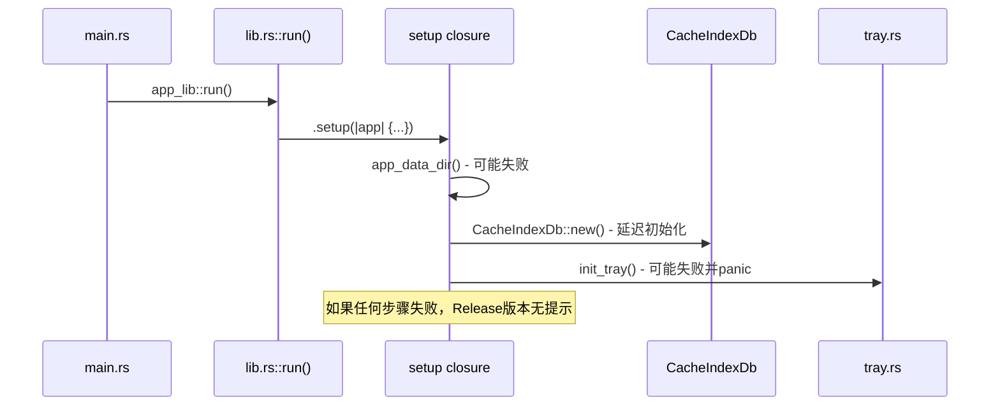
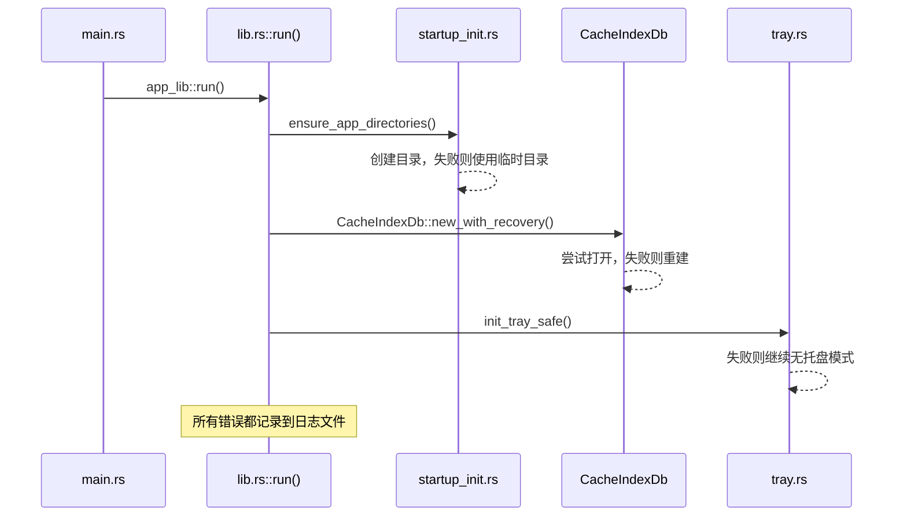

# Design Document: Release Startup Fix

## Overview

修复 NeoView Release 版本首次启动失败的问题。核心问题是应用在首次运行时，某些初始化步骤（目录创建、数据库初始化、系统托盘）可能失败，而 Release 版本隐藏了控制台，导致错误无法被发现。

## Architecture

### 当前启动流程问题分析



### 修复后的启动流程



## Components and Interfaces

### 1. 启动初始化模块 (startup_init.rs)

```rust
/// 确保应用数据目录存在
pub fn ensure_app_directories(app: &AppHandle) -> Result<PathBuf, StartupError> {
    // 1. 尝试获取标准 AppData 目录
    // 2. 如果失败，使用临时目录
    // 3. 创建所有必需的子目录
}

/// 启动错误类型
pub enum StartupError {
    DirectoryCreationFailed(String),
    DatabaseInitFailed(String),
    TrayInitFailed(String),
}
```

### 2. 数据库恢复模块 (cache_index_db.rs 增强)

```rust
impl CacheIndexDb {
    /// 带恢复功能的数据库初始化
    pub fn new_with_recovery(db_path: PathBuf, ...) -> Self {
        // 1. 尝试正常打开
        // 2. 如果失败，备份旧文件
        // 3. 创建新数据库
    }
    
    /// 安全打开数据库连接
    fn open_safe(&self) -> Result<(), String> {
        // 增加重试逻辑和错误恢复
    }
}
```

### 3. 安全托盘初始化 (tray.rs 增强)

```rust
/// 安全初始化系统托盘，失败不会导致应用崩溃
pub fn init_tray_safe<R: Runtime>(app: &AppHandle<R>) -> Result<(), String> {
    match init_tray(app) {
        Ok(_) => Ok(()),
        Err(e) => {
            log::warn!("托盘初始化失败，继续无托盘模式: {}", e);
            Ok(()) // 不返回错误，允许应用继续
        }
    }
}
```

## Data Models

### StartupConfig 扩展

```rust
#[derive(Debug, Clone, Serialize, Deserialize)]
pub struct StartupDiagnostics {
    pub app_data_path: String,
    pub directories_created: Vec<String>,
    pub database_status: DatabaseStatus,
    pub tray_status: TrayStatus,
    pub startup_time_ms: u64,
}

#[derive(Debug, Clone, Serialize, Deserialize)]
pub enum DatabaseStatus {
    Normal,
    Recovered,
    Failed(String),
}

#[derive(Debug, Clone, Serialize, Deserialize)]
pub enum TrayStatus {
    Normal,
    Disabled,
    Failed(String),
}
```

## Correctness Properties

*A property is a characteristic or behavior that should hold true across all valid executions of a system-essentially, a formal statement about what the system should do. Properties serve as the bridge between human-readable specifications and machine-verifiable correctness guarantees.*

### Property 1: 目录创建幂等性
*For any* 应用启动序列，无论执行多少次，ensure_app_directories 函数应该总是返回一个有效的目录路径，且该目录存在。
**Validates: Requirements 1.1**

### Property 2: 数据库初始化恢复
*For any* 损坏或锁定的数据库文件，new_with_recovery 函数应该能够成功返回一个可用的数据库实例（可能是新建的）。
**Validates: Requirements 1.4, 3.2**

### Property 3: 托盘初始化不阻塞
*For any* 托盘初始化失败情况，init_tray_safe 函数应该返回 Ok(())，不会导致应用崩溃。
**Validates: Requirements 4.1, 4.2, 4.3**

### Property 4: 数据库超时配置
*For any* 新创建的数据库连接，busy_timeout PRAGMA 应该被设置为至少 5000ms。
**Validates: Requirements 3.1**

## Error Handling

### 错误处理策略

| 错误类型 | 处理方式 | 用户影响 |
|---------|---------|---------|
| AppData 目录创建失败 | 使用临时目录 | 设置不会持久化 |
| 数据库打开失败 | 删除并重建 | 缓存丢失 |
| 数据库锁定 | 等待重试 | 启动稍慢 |
| 托盘初始化失败 | 继续无托盘模式 | 无系统托盘图标 |
| 图标加载失败 | 使用默认图标 | 托盘图标可能不正确 |

### 日志记录

所有启动错误都会记录到 `{AppData}/logs/startup.log`：

```
[2024-12-13 10:00:00] INFO: NeoView 启动中...
[2024-12-13 10:00:00] INFO: AppData 目录: C:\Users\xxx\AppData\Roaming\NeoView
[2024-12-13 10:00:01] WARN: 数据库文件损坏，正在重建: directory_cache.db
[2024-12-13 10:00:01] INFO: 数据库重建成功
[2024-12-13 10:00:02] INFO: 启动完成，耗时 2000ms
```

## Testing Strategy

### 单元测试

1. **目录创建测试**: 验证 ensure_app_directories 在各种条件下的行为
2. **数据库恢复测试**: 验证损坏数据库的恢复逻辑
3. **托盘安全初始化测试**: 验证托盘初始化失败时的降级行为

### 属性测试

使用 `proptest` 库进行属性测试：

1. **Property 1 测试**: 生成随机目录路径，验证目录创建的幂等性
2. **Property 2 测试**: 生成随机损坏的数据库文件，验证恢复逻辑
3. **Property 4 测试**: 验证所有数据库连接的 PRAGMA 设置

### 集成测试

1. **冷启动测试**: 删除所有 AppData 文件后启动应用
2. **损坏恢复测试**: 手动损坏数据库文件后启动应用
3. **并发启动测试**: 同时启动多个实例，验证数据库锁定处理
