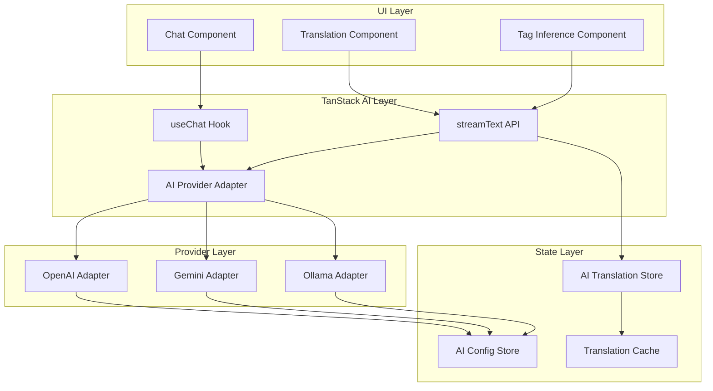

# Design Document: TanStack AI Migration

## Overview

本设计文档描述了将现有 AI API 调用方案迁移到 TanStack AI 库的技术方案。TanStack AI 是一个框架无关的 AI 交互库，提供统一的 API 来处理 AI 聊天、文本生成等功能，支持流式响应和多种 AI 提供商。

### 当前架构问题

1. **直接 SDK 调用**: 使用 `openai` 和 `@google/genai` SDK 直接调用，缺乏统一抽象
2. **无流式支持**: 当前翻译和标签推断都是等待完整响应
3. **状态管理分散**: `aiApiConfigStore` 和 `aiTranslationStore` 各自管理状态
4. **错误处理不一致**: 不同提供商的错误处理逻辑分散

### 迁移目标

1. 使用 TanStack AI 的 `useChat` 和 `streamText` API 统一 AI 调用
2. 支持流式响应，提升用户体验
3. 与 Svelte 5 响应式系统深度集成
4. 保持向后兼容，无需用户重新配置

## Architecture



## Components and Interfaces

### 1. TanStack AI Adapter (`src/lib/ai/tanstackAdapter.ts`)

统一的 AI 调用适配器，将现有配置转换为 TanStack AI 格式。

```typescript
import { createOpenAI } from '@ai-sdk/openai';
import { createGoogleGenerativeAI } from '@ai-sdk/google';
import type { AiProvider } from '$lib/stores/aiApiConfig.svelte';

export interface TanStackAIConfig {
  provider: ReturnType<typeof createOpenAI> | ReturnType<typeof createGoogleGenerativeAI>;
  model: string;
  temperature: number;
  maxTokens: number;
}

/**
 * 将现有 AiProvider 配置转换为 TanStack AI 配置
 */
export function createTanStackProvider(config: AiProvider): TanStackAIConfig {
  if (config.provider === 'gemini') {
    const google = createGoogleGenerativeAI({
      apiKey: config.apiKey,
    });
    return {
      provider: google,
      model: config.model,
      temperature: config.temperature,
      maxTokens: config.maxTokens,
    };
  }
  
  // OpenAI 兼容提供商
  const openai = createOpenAI({
    apiKey: config.apiKey,
    baseURL: config.baseUrl,
  });
  return {
    provider: openai,
    model: config.model,
    temperature: config.temperature,
    maxTokens: config.maxTokens,
  };
}
```

### 2. Streaming Translation Service (`src/lib/ai/streamingTranslation.ts`)

支持流式响应的翻译服务。

```typescript
import { streamText } from 'ai';
import type { TanStackAIConfig } from './tanstackAdapter';

export interface StreamingTranslationOptions {
  text: string;
  sourceLang: string;
  targetLang: string;
  onChunk?: (chunk: string) => void;
  onComplete?: (result: string) => void;
  onError?: (error: Error) => void;
}

export async function translateWithStreaming(
  config: TanStackAIConfig,
  options: StreamingTranslationOptions
): Promise<string> {
  const { text, sourceLang, targetLang, onChunk, onComplete, onError } = options;
  
  const prompt = `请将以下${sourceLang}文本翻译成${targetLang}，只返回翻译结果：\n${text}`;
  
  try {
    const result = await streamText({
      model: config.provider(config.model),
      prompt,
      temperature: config.temperature,
      maxTokens: config.maxTokens,
    });
    
    let fullText = '';
    for await (const chunk of result.textStream) {
      fullText += chunk;
      onChunk?.(chunk);
    }
    
    onComplete?.(fullText);
    return fullText;
  } catch (error) {
    onError?.(error as Error);
    throw error;
  }
}
```

### 3. Svelte AI Store (`src/lib/stores/ai/tanstackStore.svelte.ts`)

与 Svelte 5 集成的 AI 状态管理。

```typescript
import { writable, derived } from 'svelte/store';
import type { Message } from 'ai';

export interface AIStoreState {
  messages: Message[];
  isLoading: boolean;
  error: Error | null;
  streamingContent: string;
}

export function createAIStore() {
  const state = writable<AIStoreState>({
    messages: [],
    isLoading: false,
    error: null,
    streamingContent: '',
  });
  
  return {
    subscribe: state.subscribe,
    
    setLoading(loading: boolean) {
      state.update(s => ({ ...s, isLoading: loading }));
    },
    
    appendStreamChunk(chunk: string) {
      state.update(s => ({ 
        ...s, 
        streamingContent: s.streamingContent + chunk 
      }));
    },
    
    clearStream() {
      state.update(s => ({ ...s, streamingContent: '' }));
    },
    
    addMessage(message: Message) {
      state.update(s => ({ 
        ...s, 
        messages: [...s.messages, message] 
      }));
    },
    
    setError(error: Error | null) {
      state.update(s => ({ ...s, error }));
    },
  };
}
```

### 4. Config Converter (`src/lib/ai/configConverter.ts`)

配置格式转换器，保持向后兼容。

```typescript
import type { AiProvider, AiApiConfigJson } from '$lib/stores/aiApiConfig.svelte';
import type { TanStackAIConfig } from './tanstackAdapter';

/**
 * 验证配置是否有效
 */
export function validateConfig(config: AiProvider): { valid: boolean; errors: string[] } {
  const errors: string[] = [];
  
  if (!config.apiKey && !config.baseUrl.includes('localhost')) {
    errors.push('API Key is required for non-local providers');
  }
  
  if (!config.model) {
    errors.push('Model name is required');
  }
  
  if (!config.baseUrl) {
    errors.push('Base URL is required');
  }
  
  return { valid: errors.length === 0, errors };
}

/**
 * 导出配置为 EMM 兼容格式
 */
export function exportToEMMFormat(configs: TanStackAIConfig[]): AiApiConfigJson {
  // 转换回原始格式
  return {
    providers: configs.map(c => ({
      name: c.model,
      provider: 'openai', // 简化处理
      baseUrl: '',
      apiKey: '',
      model: c.model,
      temperature: c.temperature,
      maxTokens: c.maxTokens,
    })),
    activeIndex: 0,
  };
}
```

## Data Models

### Message Format

```typescript
// TanStack AI 标准消息格式
interface Message {
  id: string;
  role: 'user' | 'assistant' | 'system';
  content: string;
  createdAt?: Date;
}

// 序列化格式（用于持久化）
interface SerializedMessage {
  id: string;
  role: 'user' | 'assistant' | 'system';
  content: string;
  createdAt: string; // ISO 8601 格式
}
```

### Translation Result

```typescript
interface StreamingTranslationResult {
  original: string;
  translated: string;
  isStreaming: boolean;
  streamedContent: string;
  error?: string;
}
```

### Provider Config Mapping

```typescript
// 现有配置 -> TanStack AI 配置映射
const PROVIDER_MAPPING = {
  'openai': '@ai-sdk/openai',
  'gemini': '@ai-sdk/google',
  // Ollama 使用 OpenAI 兼容模式
  'ollama': '@ai-sdk/openai',
} as const;
```

## Correctness Properties

*A property is a characteristic or behavior that should hold true across all valid executions of a system-essentially, a formal statement about what the system should do. Properties serve as the bridge between human-readable specifications and machine-verifiable correctness guarantees.*

### Property Reflection

经过分析，以下属性可以合并或简化：
- 3.1 和 3.4 都涉及配置转换，可以合并为一个综合的配置转换属性
- 6.1 和 6.2 是序列化/反序列化的两面，可以合并为一个 round-trip 属性

### Properties

Property 1: Chat session initialization returns valid state structure
*For any* AI provider configuration, initializing a chat session SHALL return a state object containing an empty messages array, isLoading set to false, and error set to null.
**Validates: Requirements 1.1**

Property 2: Error handling provides standardized error format
*For any* failed AI request, the error object SHALL contain a message string and an optional code field, regardless of the underlying provider.
**Validates: Requirements 1.3**

Property 3: Provider interface consistency
*For any* valid AI provider configuration (OpenAI, Gemini, or Ollama), the resulting TanStack AI adapter SHALL expose the same `streamText` and `generateText` methods with identical signatures.
**Validates: Requirements 1.4**

Property 4: Translation caching round-trip
*For any* completed translation result, caching and then retrieving the translation SHALL return the exact same translated text.
**Validates: Requirements 2.3**

Property 5: Configuration format conversion round-trip
*For any* valid AiProvider configuration, converting to TanStack AI format and back to the original format SHALL preserve all essential fields (apiKey, baseUrl, model, temperature, maxTokens).
**Validates: Requirements 3.1, 3.2, 3.4**

Property 6: Tag inference result parsing
*For any* valid AI response containing tag data, parsing the response SHALL produce an array of tag objects with name and confidence fields.
**Validates: Requirements 5.3**

Property 7: Message serialization round-trip
*For any* array of Message objects, serializing to JSON and deserializing back SHALL produce an equivalent array of messages with the same id, role, and content values.
**Validates: Requirements 6.1, 6.2**

## Error Handling

### Error Categories

1. **Network Errors**: 连接超时、DNS 解析失败
2. **Authentication Errors**: API Key 无效、权限不足
3. **Rate Limit Errors**: 请求频率超限
4. **Provider Errors**: 模型不存在、参数无效
5. **Streaming Errors**: 流中断、解析失败

### Error Recovery Strategy

```typescript
interface AIError {
  code: 'NETWORK' | 'AUTH' | 'RATE_LIMIT' | 'PROVIDER' | 'STREAM';
  message: string;
  retryable: boolean;
  retryAfter?: number; // 毫秒
}

async function withRetry<T>(
  fn: () => Promise<T>,
  maxRetries: number = 3
): Promise<T> {
  let lastError: AIError;
  
  for (let i = 0; i < maxRetries; i++) {
    try {
      return await fn();
    } catch (error) {
      lastError = normalizeError(error);
      if (!lastError.retryable) throw lastError;
      
      const delay = lastError.retryAfter || Math.pow(2, i) * 1000;
      await sleep(delay);
    }
  }
  
  throw lastError!;
}
```

## Testing Strategy

### Dual Testing Approach

本项目采用单元测试和属性测试相结合的方式：

1. **单元测试**: 验证具体示例和边缘情况
2. **属性测试**: 验证通用属性在所有输入上成立

### Property-Based Testing

使用 `fast-check` 库进行属性测试。

```typescript
import fc from 'fast-check';

// 配置生成器
const aiProviderArb = fc.record({
  name: fc.string({ minLength: 1, maxLength: 50 }),
  provider: fc.constantFrom('openai', 'gemini'),
  baseUrl: fc.webUrl(),
  apiKey: fc.string({ minLength: 10, maxLength: 100 }),
  model: fc.string({ minLength: 1, maxLength: 50 }),
  temperature: fc.float({ min: 0, max: 2 }),
  maxTokens: fc.integer({ min: 1, max: 4096 }),
});

// 消息生成器
const messageArb = fc.record({
  id: fc.uuid(),
  role: fc.constantFrom('user', 'assistant', 'system'),
  content: fc.string({ minLength: 0, maxLength: 10000 }),
  createdAt: fc.date(),
});
```

### Test Configuration

- 属性测试最少运行 100 次迭代
- 每个属性测试必须标注对应的 Correctness Property
- 测试文件使用 `.test.ts` 后缀

## Dependencies

### New Dependencies

```json
{
  "dependencies": {
    "ai": "^3.0.0",
    "@ai-sdk/openai": "^0.0.1",
    "@ai-sdk/google": "^0.0.1"
  },
  "devDependencies": {
    "fast-check": "^3.15.0"
  }
}
```

### Removed Dependencies (After Migration)

- `openai` - 被 `@ai-sdk/openai` 替代
- `@google/genai` - 被 `@ai-sdk/google` 替代

## Migration Plan

### Phase 1: Add TanStack AI Infrastructure
1. 安装依赖
2. 创建适配器层
3. 添加属性测试

### Phase 2: Migrate Translation Service
1. 实现流式翻译
2. 更新 UI 组件
3. 保持缓存兼容

### Phase 3: Migrate Tag Inference
1. 更新 API 调用
2. 添加流式进度显示

### Phase 4: Cleanup
1. 移除旧 SDK
2. 更新文档
